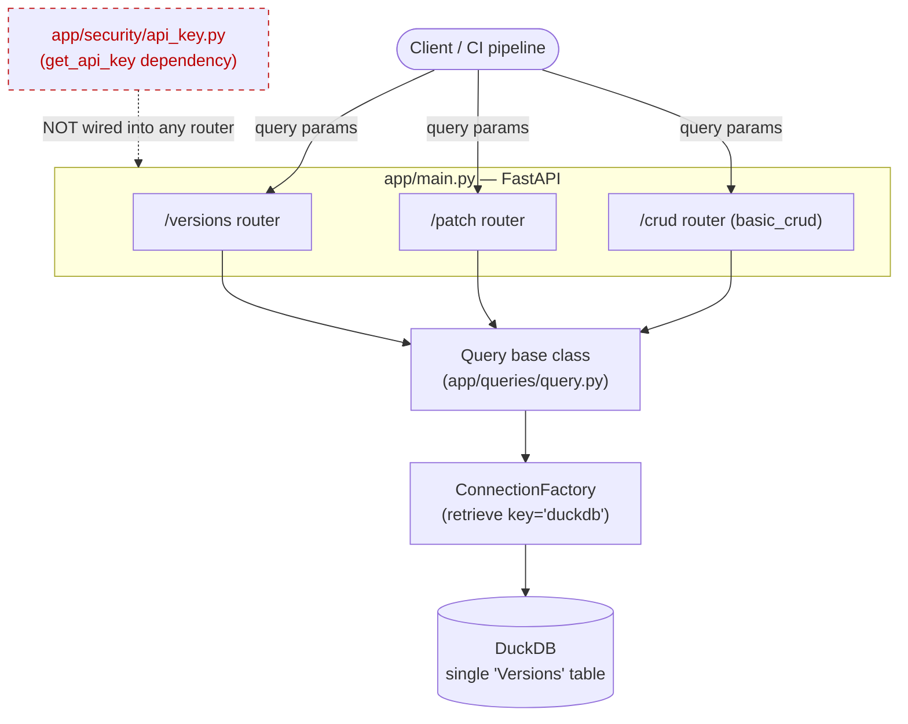
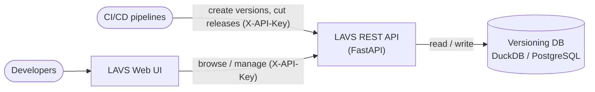
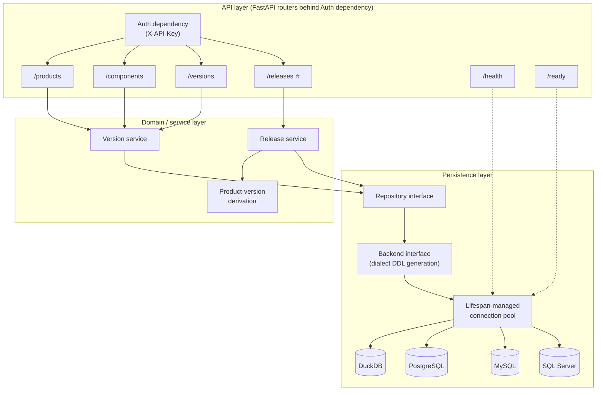
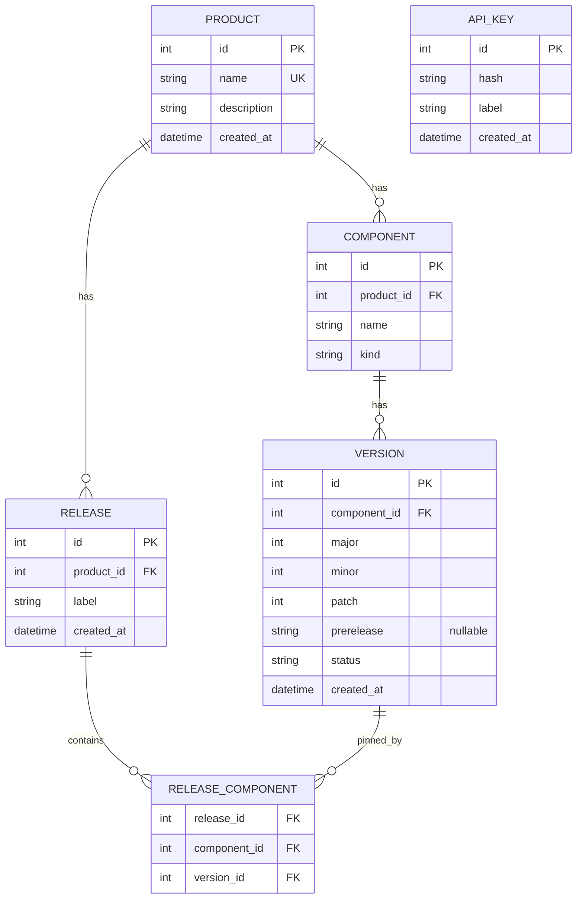
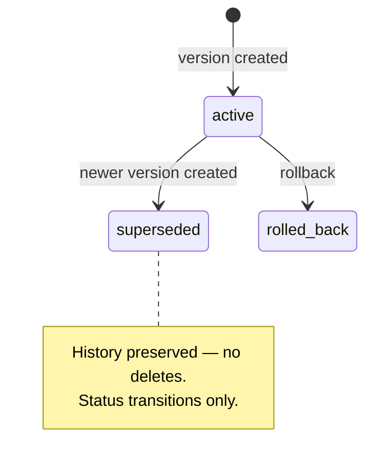
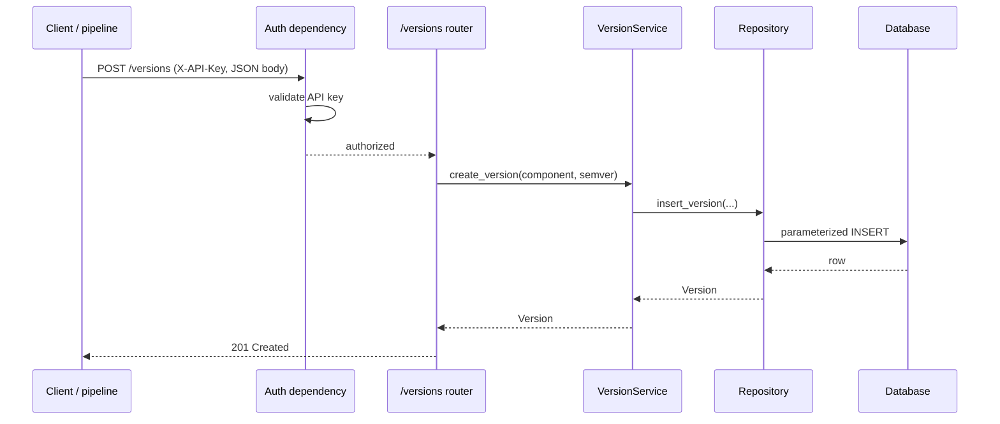
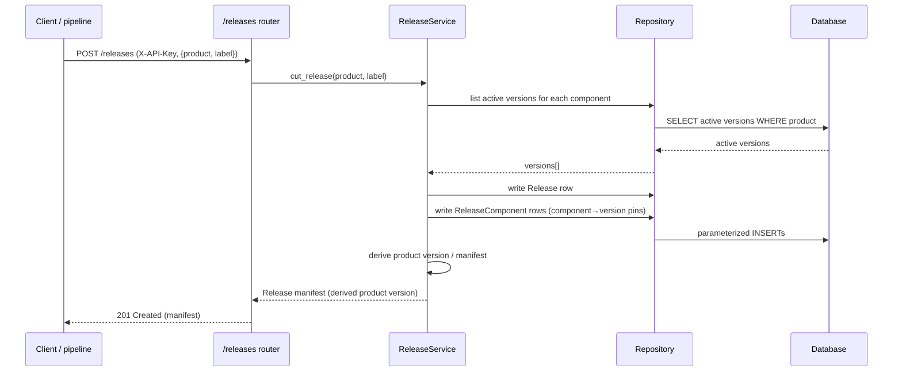
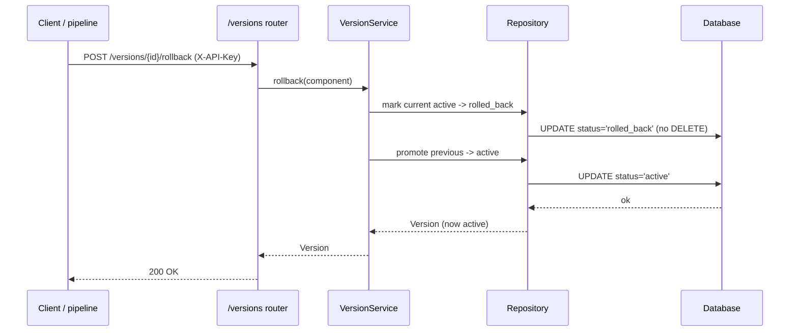
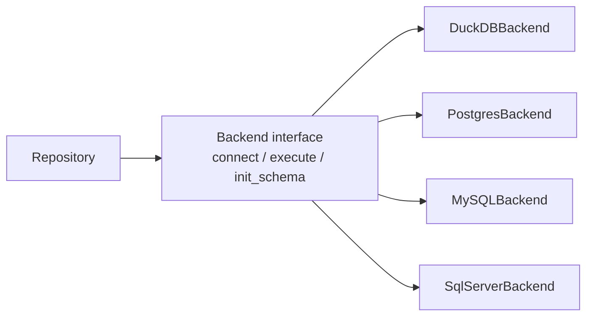
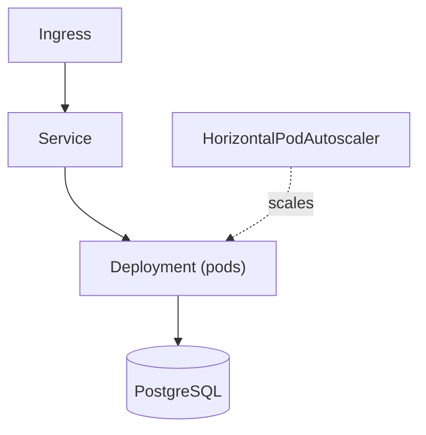

# LAVS Architecture & Design

> **LAVS** — *lowercase acronym versioning system*. A centralized REST service that
> integrates independently-versioned software components into a single, coherent
> **product** version across disparate build pipelines.
>
> Related docs: [ROADMAP.md](../planning/ROADMAP.md) · [UI_CONCEPT.md](./UI_CONCEPT.md)

---

## 1. Overview & goals

Modern products are assembled from many components — libraries, services, UIs, CLIs —
each shipped by its own pipeline on its own cadence. Two common ways of versioning such
a product are both wrong:

- **Forcing one version onto every component** couples otherwise-decoupled units. A
  trivial patch to one library shouldn't force a synchronized bump (and re-release) of
  everything else. It destroys independent release cadence.
- **Having no integrated product version at all** leaves consumers, support, and
  release engineering unable to answer "what *is* shipping together right now?" There is
  no single coordinate that names the assembled whole.

**LAVS** is the external authority that resolves this tension. Components keep their own
independent semantic versions. LAVS records those versions and **derives a coherent
product version** by snapshotting the currently-active version of each component into a
named **Release**. The product version becomes a first-class, queryable artifact that any
pipeline can read or write through one REST API.

### Goals

- Single source of truth for component versions and derived product versions.
- Let components version independently; integrate without coupling.
- Immutable version history; no destructive operations.
- Pluggable persistence: DuckDB locally, PostgreSQL (and other SQL backends) in prod.
- A web UI for browsing products, components, versions, and releases.
- Pipeline-friendly REST surface with API-key auth.

### Non-goals

- LAVS is **not** a build system, artifact registry, or package manager.
- LAVS does **not** compute or enforce semver bump *rules* — pipelines decide their own bumps; LAVS records them.
- LAVS does **not** store binaries/artifacts — only version metadata and release manifests.
- LAVS does **not** orchestrate deployments.

---

## 2. As-is architecture (today)

### As-is problems

- **Auth is not wired.** `get_api_key` / `ApiKeyDep` in [api_key.py](../../app/security/api_key.py) exists but no router `Depends` on it — every endpoint is open.
- **Per-query connections, no lifecycle.** Each `Query.execute` opens a fresh DuckDB connection via `ConnectionFactory().retrieve(...)` (see [query.py](../../app/queries/query.py)). There is no pool, no app-managed lifespan, no reuse.
- **Mutations use query params, not request bodies.** Writes are driven through query parameters rather than validated JSON bodies.
- **One table conflates everything.** The single `Versions` table (see [ddl.sql](../../app/database/duckdb/ddl.sql)) mixes product, version, and patch concepts with no notion of components or releases.
- **SQL injection via f-string.** [create_patch.py](../../app/queries/patch_version/create_patch.py) builds an `INSERT` with f-string interpolation of `product_name` and version numbers — a textbook injection vector.
- **Unanchored semver regex.** The validator in [application_and_version_model.py](../../app/models/requests/application_and_version_model.py) uses `re.compile(r"[0-9]+\.[0-9]+\.[0-9]+")` with `.match` and no `^...$` anchors, so `"1.2.3-garbage"` and `"1.2.3.4.5"` pass.
- **Destructive DELETE-based rollback.** [rollback_to_previous_patch_version.py](../../app/queries/patch_version/rollback_to_previous_patch_version.py) physically `DELETE`s the current version row, destroying history rather than recording a state transition.

---

## 3. To-be architecture

### 3.1 System context (C4-ish)

### 3.2 Container / component view

### 3.3 Layered responsibilities

| Layer | Responsibility | Key types |
|-------|----------------|-----------|
| API | HTTP routing, request/response models, auth enforcement, status codes | FastAPI routers, Pydantic request/response models, `ApiKeyDep` |
| Domain / service | Business rules: version lifecycle, release snapshotting, product-version derivation | `VersionService`, `ReleaseService`, product-version derivation |
| Persistence | Data access, parameterized SQL, dialect-aware DDL, connection pooling | `Repository`, `Backend`, `ConnectionPool` |
| Infrastructure | Concrete database drivers | `DuckDBBackend`, `PostgresBackend`, `MySQLBackend`, `SqlServerBackend` |

---

## 4. Domain model

- **Product** — the integrated whole that ships to customers. Has a unique name.
- **Component** — an independently-versioned unit belonging to a product, with a `kind`
  of `library`, `service`, `ui`, or `cli`.
- **Version** — an **immutable** record of a component's semantic version
  (`major.minor.patch` plus an optional `prerelease` label). Carries a `status` of
  `active`, `superseded`, or `rolled_back`. New versions never overwrite old ones.
- **Release** — a named snapshot for a product (a labeled point-in-time integration).
- **ReleaseComponent** — pins a single component to the exact version that participated
  in a given release. The set of ReleaseComponents *is* the derived product manifest.

### Version lifecycle

---

## 5. Key flows

### Create version

### Cut a release

### Rollback (non-destructive)

---

## 6. Persistence & multi-DB strategy

**DuckDB** is the default for local development and tests: file-based, zero-setup,
embedded. Its caveat is **single-writer** — fine for one developer or one process, but
unsuitable for concurrent multi-replica writers. **PostgreSQL** is the production target:
true concurrency, network-accessible, battle-tested.

The persistence layer hides this behind two abstractions:

- **Repository interface** — domain-shaped operations (`insert_version`, `cut_release`,
  …). Services depend only on this.
- **Backend interface** — `connect` / `execute` / `init_schema`. Each backend generates
  **dialect-aware DDL**. Today the schema is implicitly declared in
  [database.yaml](../../app/configurations/database.yaml) (a single `table` definition driven
  by `DatabaseTableConfig` in [configuration.py](../../app/configurations/configuration.py));
  this is generalized so config describes the full domain schema and each backend emits
  the correct DDL for its dialect.

Integration tests run real backends via **testcontainers** (spinning up disposable
PostgreSQL / MySQL / SQL Server containers) so dialect-specific DDL and parameterization
are exercised against the genuine engines.

---

## 7. API surface (target)

All mutations take **JSON request bodies** (not query params). Auth is via the
**`X-API-Key`** header (optional when `LAVS_API_KEY` is unset).

| Method | Path | Purpose | Auth |
|--------|------|---------|------|
| POST | `/products` | Create a product | yes |
| GET | `/products` | List products | yes |
| GET | `/products/{id}` | Get a product | yes |
| PATCH | `/products/{id}` | Update a product | yes |
| DELETE | `/products/{id}` | Remove a product | yes |
| POST | `/components` | Create a component | yes |
| GET | `/components` | List components (by product) | yes |
| GET | `/components/{id}` | Get a component | yes |
| PATCH | `/components/{id}` | Update a component | yes |
| DELETE | `/components/{id}` | Remove a component | yes |
| POST | `/versions` | Create a version | yes |
| GET | `/versions` | List versions (by component) | yes |
| GET | `/versions/latest` | Latest active version | yes |
| POST | `/versions/{id}/rollback` | Roll back (non-destructive) | yes |
| POST | `/releases` ⭐ | Cut a release (derive product version) | yes |
| GET | `/releases` | List releases (by product) | yes |
| GET | `/releases/{id}` ⭐ | Get release manifest | yes |
| GET | `/health` | Liveness | no |
| GET | `/ready` | Readiness (DB reachable) | no |

---

## 8. Security

- **API-key auth.** `X-API-Key` header validated by the `get_api_key` dependency
  ([api_key.py](../../app/security/api_key.py)); key read from the `LAVS_API_KEY` env var.
  When unset, auth is **optional** (open) — convenient for local dev, must be set in prod.
  In the to-be design this dependency is actually wired onto every data router.
- **Parameterized SQL only.** All queries use bound parameters. The f-string `INSERT` in
  [create_patch.py](../../app/queries/patch_version/create_patch.py) is the **canonical
  anti-pattern** to remove — it is a live SQL-injection vector.
- **Keys stored hashed.** API keys are persisted as hashes (`API_KEY.hash`), never plaintext.
- **No secrets in code/config.** Keys and DB credentials come from the environment, not
  source or YAML.

---

## 9. Deployment

Local dev runs DuckDB with `uvicorn app.main:app` on port **8001**
(see [main.py](../../app/main.py)). The container image **must be fixed** to use `uv` with
a `python:3.14` base. Production deploys to Kubernetes via the Helm chart in
[helm/lavs](../../helm/lavs) (deployment, service, ingress, hpa, probes — the probes
require the `/health` and `/ready` endpoints).

**DuckDB is not suitable for multi-replica production** (single-writer). With more than
one pod, writers would conflict — hence PostgreSQL is the production datastore.

---

## 10. Tech stack

- **Language / runtime:** Python 3.14
- **Web framework:** FastAPI
- **Validation:** Pydantic v2
- **Tooling:** uv (packaging/venv), ruff (lint/format), pyright (types), pytest (tests)
- **Frontend:** TypeScript 6, pnpm, vitest
- **Databases:** DuckDB (local/default) + PostgreSQL (prod), with MySQL / SQL Server backends
