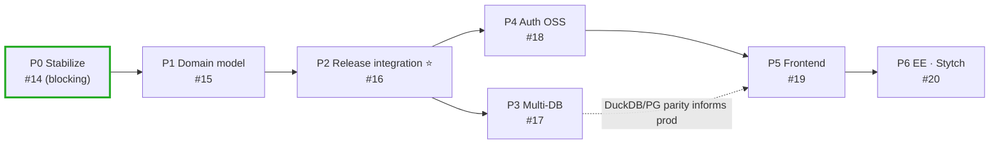
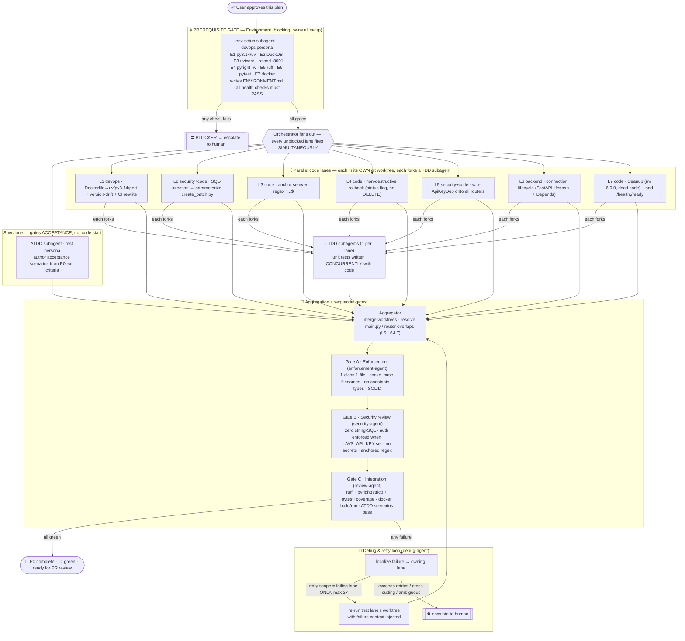

# P0 Stabilize — Multiagent Parallel Execution Plan

> **Status:** ✅ **P0 EXECUTED & GREEN (2026-06-26).** All exit criteria met — container builds & runs (`/health`,`/ready` 200), auth enforced (401/403/200), zero string-SQL, full suite 90 passed, ruff/pyright/format clean. Changes are in the working tree on `feat/14-p0-stabilize`, **not yet committed** (awaiting user). Next phase: P1 (#15).
> **Program:** the full roadmap **P0 → P6**, executed phase-by-phase (the phases are a hard dependency chain — parallelism is *within* a phase, plus **P3 ∥ P4**). **P0 executes first** and is specified in full detail below (§3–§9); P1–P6 are mapped as lanes in §1.5 and tracked as GitHub epics.
> **GitHub backlog (created):** epics **#14**(P0) **#15**(P1) **#16**(P2) **#17**(P3) **#18**(P4) **#19**(P5) **#20**(P6); P0 task tickets **#21–#27**.
> **Branch:** `feat/lavs-design-ui-foundation` → rename to **`feat/14-p0-stabilize`** (ticket = epic #14); each P0 lane runs on its own `bugfix/<issue>-…` branch/worktree.
> **Author:** orchestrator (harness) · **Date:** 2026-06-25

---

## 0. The reconciliation that governs this entire plan

You require execution that is **genuinely parallel, not sequential-described-as-parallel.** The project's own agent framework **cannot provide that**:

- `CLAUDE.md`: *"Match the user's request to **ONE** agent and load **ONLY** that file."*
- Every agent `.md`: *"Do NOT load subagents upfront… Follow the workflow steps **sequentially**."*
- `orchestrator-agent.md` coordinates via **session files + bash**, with no parallel-spawn mechanism.

**Resolution (applies everywhere below):** the project agent files are used as **role definitions, personas, and convention carriers**. Actual execution is performed by **harness-native parallel subagents** (the `Agent`/`Workflow` tooling), each running in its **own git worktree** so file-mutating lanes run truly concurrently without clobbering each other. This is the only way to satisfy the "genuinely parallel" constraint, and it is what every "subagent" in this document refers to.

---

## 1.5 Program scope — all phases (P0 → P6)

The phases are a **dependency chain**, so the *program* is sequential at the phase boundary; **genuine parallelism lives inside each phase** (the worktree-lane fan-out), with one cross-phase parallel opportunity: **P3 ∥ P4** (both depend only on P2). Each phase reuses the **same harness pattern**: `env-setup gate → ATDD + parallel worktree lanes (each forking a TDD subagent) → aggregator → enforcement/security/integration gates → debug/retry`.

| Phase | Epic | Parallel lanes within the phase (each = a worktree subagent + its TDD subagent) | Phase-specific env additions | Depends on |
|---|---|---|---|---|
| **P0** Stabilize | **#14** | **L1–L7** (#21–#27) — *detailed in §3–§9 below* | py3.14, DuckDB, uvicorn, pyright/ruff/pytest, Docker | — |
| **P1** Domain model | **#15** | `products` schema · `components` schema · immutable `versions`+status · config-driven init · refactor `/versions`+`/patch` onto model · query-param→body migration | DDL/migration harness on DuckDB | P0 |
| **P2** Release integration ⭐ | **#16** | `releases`+`release_components` schema · snapshot endpoint · derive/manifest endpoint · `release.cut` SSE emit · product-version derivation rule | SSE test client | P1 |
| **P3** Multi-DB | **#17** | Backend interface · DuckDB backend · **Postgres** backend · MySQL · SQL Server · dialect DDL gen · testcontainers suite | **+testcontainers + Docker PG/MySQL/MSSQL** | P2 *(∥ P4)* |
| **P4** Auth (OSS) | **#18** | `AuthProvider` abstraction · password+sessions · email/domain verification · API-key provider · `/health` edition+modes · session store | mail-capture stub (e.g. mailpit) | P2 *(∥ P3)* |
| **P5** Frontend | **#19** | Vite/pnpm scaffold · SVG streams/stations/meridian · scrub-to-derive · cut-release · SSE client · auth-mode login · a11y/reduced-motion | **+pnpm/vite dev server + vitest + Playwright** | P4 *(+P2 API)* |
| **P6** EE (Stytch) | **#20** | `StytchProvider` behind abstraction · Stytch callback route · UI Stytch widget · edition gating | Stytch sandbox creds | P5 |

Each phase is **re-planned and re-presented** at its boundary (an updated map + lane/subagent spec), so you approve each phase before its fan-out. This document fully specifies **P0**; P1–P6 specs are produced just-in-time as each predecessor's integration gate goes green.

---

## 1. Conventions loaded

| Convention source | Path | Loaded | Key rules extracted |
|---|---|---|---|
| Core / startup / session | `.claude/conventions/core/general.md` | ✅ | Branch-first; **mandatory session** in `.prompticorn/sessions/`; read-before-write; one-class-per-file; **filename = snake_case(class)**; SOLID; typed errors; flag new deps |
| Python conventions | `.claude/conventions/languages/python.md` | ✅ | Py 3.14 / uv / ruff / pyright **strict, continuous**; `T \| None`; **no module/class constants → pydantic-settings or YAML**; avoid `setattr/getattr`/`cast`; `__init__.py` everywhere; context managers for resources; interface-style ABCs; coverage L80/B70/F90/S85/Mut80/Path60 |
| TypeScript conventions | `.claude/conventions/languages/typescript.md` | ✅ | TS6 / pnpm / vitest / eslint+prettier; strict; no `any`; named exports; kebab-case files *(not needed for P0; relevant P5)* |
| Project config | `.prompticorn/.prompticorn.yaml` | ✅ | monorepo: **backend → `backend/api`**, frontend → `frontend/ui`; DuckDB; raw SQL; Conventional Commits; Helm deploy; mutation tool `mutmut`; mocking `unittest.mock` |
| Architecture (ADR-equivalent) | `docs/design/ARCHITECTURE.md` | ✅ | To-be layering (API/Domain/Persistence/Infra); immutable versions; parameterized SQL only; lifespan-managed connections |
| API contract | `docs/design/API_CONTRACT.md` | ✅ | Endpoint catalog, JSON bodies, `X-API-Key`, error model, SSE, locked auth decisions |
| Roadmap | `docs/planning/ROADMAP.md` | ✅ | P0 task list + **P0 acceptance criteria** (the ATDD source of truth) |
| Build/lint config | `pyproject.toml`, `.pre-commit-config.yaml`, `.flake8`, `.editorconfig` | ✅ | ruff/pyright/pytest config (**drift: targets py313, requires-python ≥3.14**) |
| CI | `.github/workflows/python-test.yml` | ✅ | **Stale** (poetry/flake8/black/bandit, py3.13, triggers on `feature/**` not `feat/**`) |
| Active session | `.prompticorn/sessions/session_20260624_design_ui.md` | ✅ | Design phase done; **next = P0**; lists the exact P0 defects |

**Gaps / conflicts in conventions** → see Gap Report (§8). Headlines: code lives at `app/` but config says `backend/api` (Gap C); version drift in `pyproject.toml` (Gap D, *also a P0 task*); stale CI (Gap F); no ticket ID (Gap H).

---

## 2. Discovered agent roster (24 agents) → pipeline-role mapping

| Pipeline role | Project agent(s) used as persona | In P0? |
|---|---|---|
| PM / requirements | `product-agent`, `plan-agent` | — (P0 already specified by ROADMAP) |
| Architect / design | `architect-agent` (+ `backend-agent`) | advisory only |
| Code implementation | `code-agent` | ✅ core |
| ATDD (scenarios before code) | `test-agent` *(ATDD mode)* | ✅ |
| TDD (tests beside code) | `test-agent` *(TDD mode)* | ✅ |
| Verify / review | `review-agent` | ✅ |
| Enforce (standards) | `enforcement-agent` | ✅ gate |
| Security | `security-agent` | ✅ gate |
| Debug / fix | `debug-agent` | ✅ retry loop |
| Orchestration | `orchestrator-agent` *(persona only — executed via harness)* | ✅ |
| DevOps / environment | `devops-agent` | ✅ **prerequisite gate** |
| Backend specialist | `backend-agent` | ✅ (lifespan lane) |

**Roles with no clean matching agent (flagged):**
- **ATDD** has no dedicated agent → run as a **mode of `test-agent`** (Gap B).
- **Environment-runner** (starts daemons/watchers) is implied by `devops-agent` but not its stated purpose → **assigned to `devops-agent` persona** (Gap B).
- **Genuine parallel orchestration** has no agent that can do it → **harness orchestrator** (Gap A, the §0 reconciliation).

---

## 3. Environment manifest (Step 4 — the hard prerequisite gate)

A single **`env-setup` subagent** (devops persona) runs **before any other lane is unblocked**. It *starts* everything itself — it never asks the human to run a command. P0 is backend-only; **no Postgres/MySQL/MSSQL and no frontend toolchain are required** (those arrive P3/P5).

| # | Service / process | Purpose | How it's started (pipeline-owned) | Health check (must pass) | Stop cleanly |
|---|---|---|---|---|---|
| E1 | **Python 3.14 toolchain** | Project requires `>=3.14`; **system python is 3.12.3** | `uv python install 3.14` → `uv sync` | `uv run python -V` → `3.14.x`; `uv run python -c "import app.main"` imports clean | n/a (toolchain) |
| E2 | **DuckDB (embedded)** | Local default datastore | init via app config / DDL on first connect | open connection + `SELECT 1`; target table/schema present | file handle closed by lifespan |
| E3 | **Uvicorn dev server + reload** | Run the API; live-reload watcher for the work ahead | `uv run uvicorn app.main:app --reload --port 8001` (background) | `GET http://127.0.0.1:8001/` → 200; add+probe `GET /health` (built in Lane 7) | kill tracked PID |
| E4 | **pyright (watch)** | Conventions demand **continuous** strict typing | `uv run pyright -w` (background) | first pass completes; error count captured as baseline | kill tracked PID |
| E5 | **ruff (lint+format check)** | Continuous lint | `uv run ruff check .` / `--watch` | exit 0 or baseline recorded | kill tracked PID |
| E6 | **pytest runner** | TDD/ATDD execution + coverage | `uv run pytest -q --cov=app` | baseline suite runs (green or known-red recorded) | n/a (on-demand) |
| E7 | **Docker daemon + image build** | P0 acceptance = *container builds & runs* | verify daemon (`docker version`), build after Lane 1 fixes Dockerfile | `docker run` → container serves `GET /health` on mapped port | `docker rm -f` tracked container |

**Dependency:** `env-setup` → (E1 → E2 → E3/E4/E5/E6 in parallel; E7 verified now, full build gated on Lane 1). **If any health check fails (e.g., `uv` cannot fetch Python 3.14, or Docker daemon down) → immediate BLOCKER, escalate, no lane proceeds.** Output: a written `ENVIRONMENT.md` (what was started, how to verify, how to stop) + a machine-readable readiness signal the orchestrator gates on.

---

## 4. Execution map

---

## 5. Subagent specification

Every subagent receives the same **payload envelope**: `{ persona = <agent>.md, conventions = general.md + python.md, task scope, I/O interfaces, worktree }`.

### Prerequisite
| Subagent | Parent | Scope | Inputs | Outputs | Convention constraints |
|---|---|---|---|---|---|
| **env-setup** | orchestrator | Stand up & health-check E1–E7; write `ENVIRONMENT.md` | manifest §3, repo | running services, readiness signal, `ENVIRONMENT.md` | pipeline owns all startup; no manual human steps; nothing assumed up |

### Spec lane
| Subagent | Parent | Scope | Inputs | Outputs | Constraints |
|---|---|---|---|---|---|
| **ATDD** | test-agent | Author executable acceptance scenarios from **P0 exit criteria** | ROADMAP P0 acceptance, API_CONTRACT | `tests/acceptance/` scenarios (container builds/runs; auth enforced; zero string-SQL; bad semver→422; rollback preserves history; CI green) | AAA structure; behavior not implementation; pytest markers |

### Code lanes (each in its own worktree; each forks one TDD subagent)
| Lane | Parent persona | Scope (files) | Inputs | Outputs | Convention constraints |
|---|---|---|---|---|---|
| **L1** | devops-agent | `Dockerfile` (uv, `python:3.14`, port 8001↔8080 aligned), `pyproject.toml` (ruff `target-version=py314`, pyright `pythonVersion=3.14`), `.github/workflows/python-test.yml` (uv+ruff+pyright+pytest, py3.14, trigger `feat/**`) | ROADMAP P0, pyproject | fixed image + CI; drift removed | no secrets in image; pinned base; flag any new dep |
| **L2** | security-agent + code-agent | `app/queries/patch_version/create_patch.py` | ARCHITECTURE §8, query.py pattern | parameterized INSERT (bound params) | **parameterized SQL only**; typed errors |
| **L3** | code-agent | `app/models/requests/application_and_version_model.py` | API_CONTRACT §4 (`^\d+\.\d+\.\d+$`) | anchored regex + reject tests | pydantic v2; `T\|None` |
| **L4** | code-agent | `app/queries/patch_version/rollback_to_previous_patch_version.py` (+ status enum) | domain model (status `active\|superseded\|rolled_back`) | status-flag rollback; **no DELETE** | immutable history; 1-class-1-file; no constants→config/enum |
| **L5** | security-agent + code-agent | `app/routers/*.py` (versions, patch, basic_crud), `app/security/api_key.py` | api_key.py `ApiKeyDep` | `Depends(ApiKeyDep)` on all data routers | auth optional when `LAVS_API_KEY` unset; key hashed; no secrets in code |
| **L6** | backend-agent | `app/main.py` (lifespan), `app/queries/query.py`, `app/connections/*` | ARCHITECTURE §6, query.py | FastAPI `lifespan` + connection `Depends`; no per-query connect | context managers for resources; DIP; no circular imports |
| **L7** | code-agent | delete root `6.0.0`; strip dead code in `app/main.py`; add `GET /health`,`GET /ready` | ARCHITECTURE §7, Helm probes | clean main; health/ready endpoints | read-before-write; smallest change; verify target before delete |
| **TDD×7** | test-agent (per lane) | unit tests beside each lane's change | the lane's diff | `tests/unit/...` with coverage ≥ targets | AAA; mock externals (`unittest.mock`); parametrize; `pytest.raises` |

**GitHub tickets (branch/commit IDs):** L1 **#21** · L2 **#22** · L3 **#23** · L4 **#24** · L5 **#25** · L6 **#26** · L7 **#27** — all under epic **#14**. Each lane's worktree branches as `bugfix/<issue>-<slug>` (e.g. `bugfix/22-fix-sql-injection`); commits reference the issue (Conventional Commits + `#<issue>`).

### Aggregation & gates
| Subagent | Parent | Scope | Inputs | Outputs | Constraints |
|---|---|---|---|---|---|
| **Aggregator** | orchestrator | Merge 7 worktrees; resolve L5/L6/L7 overlap on `main.py`/routers | all lane diffs | one consistent working tree | preserve every lane's intent; no silent drops |
| **Enforcement (Gate A)** | enforcement-agent | Verify conventions on merged tree | merged diff, general.md/python.md | pass / change-requests | 1-class-1-file, snake_case filenames, no constants, types, SOLID |
| **Security (Gate B)** | security-agent | Verify security posture | merged diff | pass / findings | zero string-SQL, auth enforced, anchored regex, no secrets |
| **Integration (Gate C)** | review-agent | Run full toolchain + ATDD + docker | merged tree, ATDD scenarios | green/red verdict | ruff+pyright-strict+pytest+coverage; container builds & runs |
| **Debug** | debug-agent | Localize failures, drive retries | gate failures | fix or escalation | retry failing lane only; root-cause before patch |

---

## 6. Convention enforcement — where each rule is checked

| Convention | Applied by | Verified at checkpoint |
|---|---|---|
| One class per file · `snake_case` filename | every code lane | **Gate A** (enforcement) |
| No module/class constants (→ pydantic-settings/YAML/enum) | L4 (status enum), all | **Gate A** |
| `T\|None`, no `cast`, no `setattr/getattr`, `__init__.py` present | all code lanes | **Gate A** + pyright in **Gate C** |
| Parameterized SQL only | L2 (primary), L4/L6 | **Gate B** |
| Auth wired & enforced when `LAVS_API_KEY` set; keys hashed; no secrets | L5 | **Gate B** |
| Anchored semver regex | L3 | **Gate B** |
| Lifespan-managed connections; context managers | L6 | **Gate C** (integration) + Gate A |
| Coverage L80/B70/F90/S85 | TDD subagents | **Gate C** |
| Conventional Commits; ticket ID | aggregator (commit) | pre-PR (Gap H must resolve) |
| pyright **strict, continuous** | env (E4 watch) + all | live + **Gate C** |

---

## 7. Test strategy

- **ATDD (before code):** the ATDD subagent translates **P0 acceptance criteria** into executable scenarios *at fan-out*, in parallel with code lanes. They do **not** block code from starting (the fixes are fully specified by ROADMAP), but they **gate acceptance** at Gate C — code is not "done" until scenarios pass. Scenarios: container builds & runs; auth enforced with key set / open without; **no string-interpolated SQL anywhere**; `1.2.3.4`/`1.2.3abc` → 422; rollback preserves history (no row deleted); CI green.
- **TDD (with code):** each code lane **forks a concurrent TDD subagent** that writes unit tests against that lane's behavior as the code is written — true concurrency, not after-the-fact. Mocks per `test-mocking-rules`; AAA per `test-aaa-structure`; categories per `test-coverage-categories`.
- **Validation point:** both ATDD and TDD outputs are validated against established patterns and coverage targets at **Gate C (Integration)** on the merged tree, plus `mutmut` on core logic (L2/L4/L6) where time permits.

---

## 8. Gap report

| ID | Gap / conflict | Severity | Proposed fallback |
|---|---|---|---|
| **A** | Project agents are **sequential by design**; no parallel-spawn mechanism | 🔴 critical | Use agent files as personas; execute via **harness parallel subagents in worktrees** (the §0 reconciliation) |
| **B** | No dedicated **ATDD** agent; no explicit **environment-runner** role | 🟠 | ATDD = mode of `test-agent`; env-runner = `devops-agent` persona |
| **C** | Code at `app/` but `.prompticorn.yaml`+`general.md` declare backend at **`backend/api`** | 🟠 | P0 keeps `app/` (smallest change); raise `app/`→`backend/api` migration as a **separate decision** (don't bundle into P0) |
| **D** | `pyproject.toml` ruff `py313` + pyright `3.13` vs `requires-python>=3.14` | 🟠 | **Fixed inside Lane 1** (it's a P0 task) |
| **E** | **System Python is 3.12.3**; project needs 3.14 | 🔴 blocker-risk | `uv python install 3.14`; if uv cannot fetch 3.14 → **hard blocker, escalate immediately** |
| **F** | CI workflow stale (poetry/flake8/black/bandit, py3.13) **and triggers on `feature/**` not `feat/**`** → won't even run on this branch | 🟠 | **Rewritten in Lane 1** (uv/ruff/pyright/pytest, py3.14, correct branch glob) |
| **G** | `/health` `/ready` don't exist; Helm probes + container health depend on them | 🟡 | **Added in Lane 7**; E3/E7 health checks use them once present (fallback `GET /` until then) |
| **H** | Branch `feat/lavs-design-ui-foundation` has **no ticket ID** (convention mandates real IDs) | ✅ **resolved** | GitHub epics **#14–#20** + P0 tasks **#21–#27** created; branch renames to `feat/14-p0-stabilize`, lanes to `bugfix/<issue>-…` |
| **I** | `main.py` mixes concerns (not 1-class-per-file spirit); dead code | 🟡 | Cleaned in L7; Gate A enforces on new code |

---

## 9. Debug & retry logic

- **Owner:** `debug-agent` (persona), driven by the harness orchestrator.
- **How failures surface:** any Gate (A/B/C) returns a structured failure → orchestrator routes to Debug with the failing artifact + logs.
- **Retry scope:** **failing lane only** — re-run that lane's worktree subagent with the failure context injected; **never** restart the whole pipeline for one lane. Max **2 retries** per lane.
- **Escalation to you:** triggered when (a) a lane exceeds 2 retries, (b) the failure is cross-cutting (touches multiple lanes' shared files, e.g., a `main.py` merge conflict Aggregator can't reconcile), (c) an **environment blocker** (Gap E), or (d) a convention conflict needing a human decision (Gap C, H). Pipeline **pauses all lanes and re-presents** on any material change.

---

## Approval

**Decisions resolved:**
1. **Scope** — the plan now covers the **full program P0 → P6** (§1.5), executed phase-by-phase with each phase re-presented at its boundary. **P0 executes first** (this document, in full).
2. **Tickets (Gap H)** — created in GitHub: epics **#14–#20**, P0 tasks **#21–#27**. Branch/commit IDs are wired in.

On approval I will **immediately** (Step 6), **for P0 first**: rename the branch to `feat/14-p0-stabilize`; run the `env-setup` gate; once all health checks pass, **fan out all 8 lanes (ATDD + L1–L7) simultaneously**, each in its own worktree forking its TDD subagent, monitor all streams concurrently, and gate at the aggregator → enforcement → security → integration. Mechanism: a single harness `Workflow` with worktree-isolated parallel subagents. When P0's integration gate is green, I **pause and re-present P1** before its fan-out.

**Reply to approve P0 execution, or redirect.** (One open input that is *not* blocking: Gap C — whether to also migrate `app/` → `backend/api`; my recommendation is to keep `app/` for P0 and treat the move as its own ticket.)
