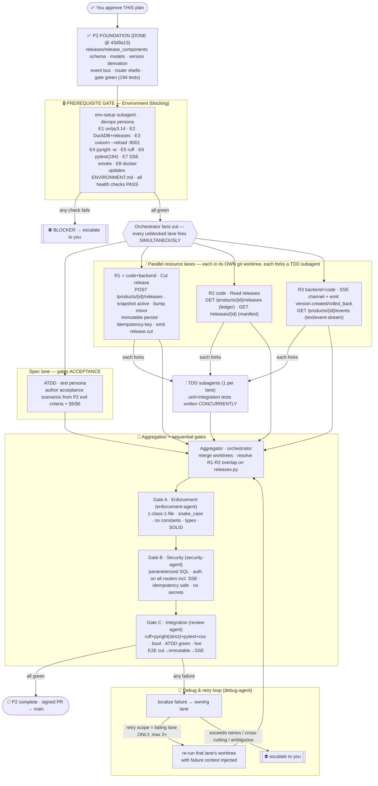

# P2 Release Integration ⭐ — Multiagent Parallel Execution Plan

> **Status:** ✅ **P2 COMPLETE & GREEN (2026-07-11).** All exit criteria met — cut an immutable release
> from mixed active versions (server-owned `product_version`, minor bump from base), read the ledger +
> frozen manifest, live SSE `release.cut`/`version.*`. Idempotency-Key dedups; a cut release never changes.
> Foundation + env-setup gate + R1/R2/R3 + ATDD merged onto `feat/16-p2-release-integration`;
> **257 tests pass**, ruff/format/pyright clean, all gates (enforcement/security/integration) green,
> and a **live HTTP E2E** confirmed cut→immutable→**real SSE wire `release.cut`**→idempotency. Signed
> commits. Next phase: P3 (Multi-DB) ∥ P4 (Auth).
>
> **Original plan (awaiting-approval, 2026-07-11).** Branch `feat/16-p2-release-integration` off `main`
> (P1 merged @ `d09b185`). Commit signing active (SSH, verified). Epic #16 · Linear *P2 — Release
> integration* (LAV-16…LAV-20).
> **Foundation is already DONE & gated** (`43d9a13`, `p2-foundation`): releases/release_components
> schema, models, version derivation, in-process event bus, router shells — 194 tests green,
> pyright/ruff clean. **This plan covers the remaining resource wave** and is presented in full per the
> multiagent-implementation governance framework. **No resource lane fires until you approve.**

This document follows the 9-section governance spec. It is the authored deliverable for your review.

---

## 1. Conventions loaded

| Source | Path | Loaded | Key rules extracted |
|---|---|---|---|
| Core / startup / session | `.claude/conventions/core/general.md` | ✅ | Branch-first; read-before-write; **one class per file**; **filename = snake_case(class)**; SOLID; typed errors; flag new deps |
| Python conventions | `.claude/conventions/languages/python.md` | ✅ | Py 3.14 / uv / ruff / pyright **strict**; `T \| None`; **no module/class constants → enum/pydantic-settings/YAML**; avoid `cast`/`setattr`/`getattr`; `__init__.py` everywhere; context managers; interface-style ABCs |
| Project config | `.prompticorn/.prompticorn.yaml` | ✅ | uv · pytest (**hybrid**) · ruff · DuckDB · **raw SQL (no ORM)** · exceptions · Conventional Commits · Helm · `unittest.mock` · `mutmut` · **coverage L80/B70/F90/S85/Mut80/Path60** |
| Architecture (ADR-equivalent) | `docs/design/ARCHITECTURE.md` | ✅ | API/Domain/Persistence layering; **immutable versions & releases**; parameterized SQL only; lifespan-managed connection |
| API contract | `docs/design/API_CONTRACT.md` §5/§6/§3 | ✅ | Cut-release semantics; SSE event shapes; Release/ReleaseComponent schemas; `X-API-Key`; uniform error envelope |
| Roadmap | `docs/planning/ROADMAP.md` (P2) | ✅ | P2 task list + **exit criteria** (ATDD source of truth) |
| Env manifest (prior) | `docs/planning/ENVIRONMENT.md` | ✅ | P0 env template being extended for P2 |
| TypeScript conventions | `.claude/conventions/languages/typescript.md` | ✅ (not exercised) | P5 concern; no TS in P2 |

**Gaps/ambiguities flagged (Step 1):**
- **G1 — Coverage enforcement is nominal.** `.prompticorn.yaml` sets mutation 80 / path 60, but no `mutmut` run is wired into CI. P2 targets line/branch/function via `pytest-cov`; **mutation testing is not run** (documented shortfall, carried from P0/P1).
- **G2 — Monorepo path drift.** Config declares backend at `backend/api`; code lives at `app/`. Unchanged since P0 (deliberate). Not re-litigated in P2.
- **G3 — "message broker" (Step 4) is N/A.** The realtime layer is an **in-process asyncio event bus**, by design (single-process DuckDB app). No external broker to start.

---

## 2. Discovered agent roster (24) → P2 pipeline roles

| Pipeline role | Project agent (persona) | In P2 wave? |
|---|---|---|
| Orchestration (genuine parallel) | `orchestrator-agent` *(persona; executed by harness)* | ✅ |
| Environment runner | `devops-agent` | ✅ **prerequisite gate** |
| Foundation / architecture | `backend-agent` + `architect-agent` | ✅ (DONE) |
| Cut-release impl | `code-agent` + `backend-agent` | ✅ R1 |
| Read impl | `code-agent` | ✅ R2 |
| SSE / async streaming | `backend-agent` + `code-agent` | ✅ R3 |
| ATDD (scenarios before code) | `test-agent` *(ATDD mode)* | ✅ |
| TDD (tests beside code) | `test-agent` *(TDD mode, forked per lane)* | ✅ |
| Enforce (standards) | `enforcement-agent` | ✅ Gate A |
| Security | `security-agent` | ✅ Gate B |
| Verify / integration | `review-agent` | ✅ Gate C |
| Debug / fix | `debug-agent` | ✅ retry loop |

**Roles with no clean matching agent (flagged, same as P0/P1):**
- **A — ATDD** has no dedicated agent → run as a **mode of `test-agent`**.
- **B — Environment-runner** is implied by `devops-agent` but not its stated purpose → assigned to `devops-agent` persona.
- **C — Genuine parallel orchestration** — no agent can spawn concurrent streams → **harness orchestrator** executes; project agents are personas/convention-carriers.
- Unused in P2 (no role): product/plan/frontend/data/mlai/compliance/incident/observability/performance/refactor/migration/document/explain/ask — flagged as not-applicable this wave.

---

## 3. Environment manifest (Step 4 — hard prerequisite gate)

A dedicated **`env-setup` subagent (devops persona)** stands up and health-checks everything **before any
resource lane is unblocked**. It starts processes itself — no manual human steps. It writes an updated
`docs/planning/ENVIRONMENT.md` and emits a machine-readable readiness signal the orchestrator gates on.

| # | Service / process | Purpose | Start (pipeline-owned) | Health check (must pass) | Stop cleanly |
|---|---|---|---|---|---|
| E1 | **Python 3.14 / uv** | toolchain | `uv python pin 3.14 && uv sync` | `uv run python -V`→3.14.x; `uv run python -c "import app.main"` | n/a |
| E2 | **DuckDB (embedded)** | datastore | opened by app lifespan | `SELECT 1`; **`releases`+`release_components` present** after boot | closed by lifespan |
| E3 | **Uvicorn dev server + reload** | live API for E2E + SSE observation | `uv run uvicorn app.main:app --host 127.0.0.1 --port 8001 --reload` (bg) | `GET /health`→200, `GET /ready`→200 (exercises lifespan → schema init + event bus) | kill tracked PID |
| E4 | **pyright (watch)** | continuous strict types | `uv run pyright -w` (bg) | first pass 0 errors (baseline) | kill PID |
| E5 | **ruff** | continuous lint | `uv run ruff check .` | clean/baseline recorded | n/a |
| E6 | **pytest + cov** | TDD/ATDD execution | `uv run pytest -q --cov=app` | **194 baseline green** | on-demand |
| E7 | **SSE live smoke client** | P2-specific: observe `release.cut` on the live stream | httpx/`curl -N localhost:8001/products/{id}/events` helper the env-setup writes + documents | receives a `release.cut` frame after a cut | n/a |
| E8 | **Docker** *(verify-only)* | P2 doesn't change the image | `docker version` | daemon reachable (build re-verified at integration, not required for P2 logic) | `docker rm -f` if run |

**Reconciliation (worktree isolation vs. one live server) — see Gap G4.** E3/E4 run on the **integration
checkout** (this main working tree at `p2-foundation`) and serve the aggregation/integration gate + human
observation + live SSE smoke. **Each parallel resource lane additionally self-verifies inside its own git
worktree** (`uv sync` + its own `pyright`/`pytest`). Dependency: **E1→E2→(E3‖E4‖E5‖E6); E7 after E3; E8
verify-only.** Any health-check failure ⇒ **BLOCKER, escalate, no lane proceeds.**

---

## 4. Execution map

---

## 5. Subagent specification

Every subagent receives the same envelope: `{ persona = <agent>.md, conventions = general.md + python.md + .prompticorn.yaml, task scope, I/O interfaces, worktree }`.

### Prerequisite
| Subagent | Parent | Scope | Inputs | Outputs | Constraints |
|---|---|---|---|---|---|
| **env-setup** | orchestrator | Stand up & health-check E1–E8; update `ENVIRONMENT.md`; emit readiness signal | manifest §3, repo | running E3/E4, baselines, readiness=GREEN | pipeline owns all startup; no manual human steps |

### Spec lane
| Subagent | Parent | Scope | Inputs | Outputs | Constraints |
|---|---|---|---|---|---|
| **ATDD** | test-agent | Executable acceptance scenarios from P2 exit criteria | ROADMAP P2, API_CONTRACT §5/§6 | `tests/acceptance/` (cut→manifest; derive; **immutability**; idempotency; SSE `release.cut`) | AAA; behavior not impl; collect-clean (red until lanes land) |

### Resource lanes (each own worktree; each forks one TDD subagent)
| Lane | Persona | Scope (files it owns) | Inputs | Outputs | Convention constraints |
|---|---|---|---|---|---|
| **R1** ⭐ | code+backend+security | `app/routers/releases.py` (cut route), `app/queries/releases/*`, its tests | `CutReleaseModel`, `next_product_version`, event bus, DDL | `POST /products/{id}/releases`: snapshot active → bump minor → immutable persist → `Idempotency-Key` dedup → emit `release.cut` → 201 manifest | parameterized SQL; immutable; typed 404/409; no constants |
| **R2** | code | `app/routers/releases.py` (read routes), `app/queries/releases_read/*` (distinct pkg to avoid collision), its tests | Release models, DDL | `GET /products/{id}/releases` (ledger, newest-first, 404), `GET /releases/{id}` (frozen manifest, 404) | read-only; parameterized SELECT; 1-class-1-file |
| **R3** | backend+code | `app/routers/events.py` (SSE), `app/sse/*`, **+ `app/routers/versions.py` & `app/queries/versions/*` (add publish calls only)**, its tests | event bus, `EventType`, versions endpoints, API_CONTRACT §6 | `GET /products/{id}/events` (`text/event-stream`); emit `version.created`/`version.rolled_back`/(`release.cut` via bus) | Starlette streaming; unsubscribe on disconnect; no subscriber leak; preserve existing version-endpoint behavior |
| **TDD×3** | test-agent (per lane) | unit+integration tests beside each lane | the lane's diff | `tests/…` ≥ coverage floors | AAA; `unittest.mock`; `pytest.raises`; parametrize |

### Aggregation & gates
| Subagent | Parent | Scope | Constraints |
|---|---|---|---|
| **Aggregator** | orchestrator | Merge 3 lanes+ATDD; **resolve R1/R2 overlap on `releases.py`** (combine route sets) | preserve every lane's intent; no silent drops |
| **Gate A · Enforcement** | enforcement-agent | conventions on merged tree | 1-class-1-file, snake_case, no constants, types, SOLID |
| **Gate B · Security** | security-agent | security posture | parameterized SQL; auth on all routers incl. SSE; idempotency race-safe; no secrets |
| **Gate C · Integration** | review-agent | full toolchain + ATDD + live E2E | ruff+pyright-strict+pytest+cov; boot; **cut→immutable→SSE** on the live E3 server |
| **Debug** | debug-agent | localize failures, drive retries | failing lane only; root-cause first |

**Known aggregation hazard (pre-declared):** R1 and R2 both edit `app/routers/releases.py` (different routes). The aggregator merges by **combining both route sets**; if git 3-way conflicts, resolve by keeping both. R3's edits to `versions.py` are disjoint from R1/R2.

---

## 6. Convention enforcement — where each rule is checked

| Convention | Applied by | Verified at |
|---|---|---|
| One class per file · snake_case filename | every lane | **Gate A** |
| No constants → enum/config (e.g. `EventType`, no bare SSE strings) | R1/R3/foundation | **Gate A** |
| `T\|None`, no `cast`/`setattr`, `__init__.py` | all lanes | **Gate A** + pyright (E4/Gate C) |
| **Parameterized SQL only** | R1 (primary), R2 | **Gate B** |
| Auth dep on all routers **incl. SSE** | R1/R2/R3 | **Gate B** |
| Immutable releases (pinned `version_id`s never change) | R1 | **Gate C** (ATDD immutability scenario) |
| Idempotency-Key dedup (no double-cut) | R1 | **Gate B/C** |
| SSE unsubscribe/no-leak on disconnect | R3 | **Gate C** |
| Coverage L80/B70/F90/S85 | TDD subagents | **Gate C** (pytest-cov) |
| Conventional Commits + `#16` + **signed** | aggregator (commit) | pre-PR |

---

## 7. Test strategy

- **ATDD (before/parallel to code):** the ATDD subagent translates **P2 exit criteria** into executable
  scenarios at fan-out — cut a release from mixed active versions → coherent `product_version` + frozen
  manifest; re-read via ledger and by id; **immutability** (later versions/rollbacks don't mutate a cut
  release); `Idempotency-Key` prevents double-cut; SSE delivers `release.cut`. They gate **acceptance** at
  Gate C (red until lanes land).
- **TDD (with code):** each resource lane **forks a concurrent TDD subagent** writing unit+integration tests
  as code is written. Mocks per `test-mocking-rules`; AAA per `test-aaa-structure`; categories per
  `test-coverage-categories`.
- **Validation point:** both validated at **Gate C** on the merged tree against coverage floors, plus the
  **live E2E** on the E3 uvicorn server (real cut → real SSE frame). `mutmut` on R1's cut logic **if time
  permits** (else documented per G1).

---

## 8. Gap report

| ID | Gap / conflict | Severity | Fallback |
|---|---|---|---|
| **G1** | Mutation testing (`mutmut`) not wired; coverage floors enforced only via `pytest-cov` | 🟡 | Run line/branch/function coverage at Gate C; mutmut on R1 cut logic if time permits; document shortfall |
| **G2** | Code at `app/` vs config `backend/api` | 🟠 | Keep `app/` (P0 decision); out of P2 scope |
| **G3** | Step 4 "message broker" N/A — realtime is in-process asyncio bus | 🟢 | By design (single-process); no broker to start; documented |
| **G4** | **Live dev server + watchers vs. worktree-isolated parallel lanes** | 🟠 | E3/E4 run on the integration checkout (E2E + SSE + human observation); each lane self-verifies in its own worktree via `uv sync` + `pytest`/`pyright` |
| **G5** | SSE over `TestClient` is finicky in-process | 🟡 | Unit-test the SSE generator/formatter deterministically; assert emission via the event bus; live-stream assertion done against E3 at Gate C |
| **G6** | First-cut version semantics (`base 0.0.0` → `0.1.0` vs verbatim base) | 🟢 | **Decided:** minor bump from base → first cut `0.1.0` (foundation `next_product_version`); ATDD pins it |
| **G7** | "Nothing to release" (product with no active versions) | 🟡 | **Decided:** cut → **409 conflict**; ATDD pins it |
| **A/B/C** | ATDD/env-runner/parallel-orchestration have no dedicated agent | 🟠 | test-agent mode / devops persona / harness (as P0/P1) |

---

## 9. Debug & retry logic

- **Owner:** `debug-agent` (persona), driven by the harness orchestrator.
- **Surfacing:** any Gate (A/B/C) returns a structured failure → orchestrator routes to Debug with the failing artifact + logs (and the live E3 server for reproduction).
- **Retry scope:** **failing lane only** — re-run that lane's worktree subagent with failure context injected; never restart the whole wave. **Max 2 retries per lane.**
- **Escalation to you:** (a) a lane exceeds 2 retries; (b) cross-cutting failure (e.g. an `releases.py` merge the aggregator can't reconcile, or a version-endpoint regression from R3's publish calls); (c) an environment blocker (E1–E7 down); (d) a convention/contract ambiguity needing a human decision. Pipeline **pauses all lanes and re-presents** on any material change.

---

## Approval

**On your approval I will, in order:** (1) run the **env-setup** subagent and update `ENVIRONMENT.md`; (2) once
all health checks are GREEN, **fan out R1 + R2 + R3 + ATDD simultaneously**, each in its own worktree forking a
TDD subagent; (3) aggregate (resolving the `releases.py` overlap) → enforcement → security → integration (incl.
live E2E cut→immutable→SSE); (4) drive debug/retry; (5) open a **signed** PR to `main` (#16) — no `--admin`
bypass needed.

**Reply to approve, or redirect.** Nothing fires until you do.
