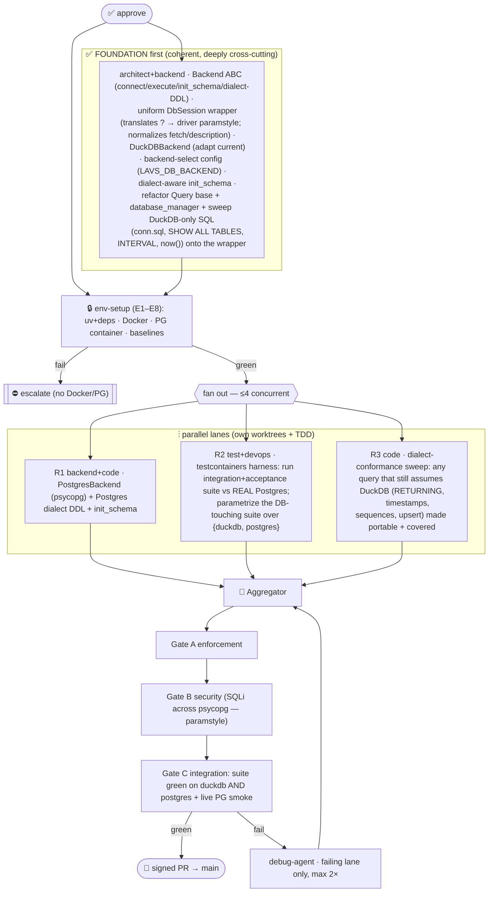

# P3 Multi-DB Backends — Multiagent Parallel Execution Plan

> **Status:** ⏸ **AWAITING APPROVAL (2026-07-12).** Would branch `feat/17-p3-multi-db` off `main`
> (P4 merged @ `b0cd194`). Commit signing active. Epic #17 · Linear *P3 — Multi-DB backends*.
> Presented per the 9-section governance framework. **Nothing fires until you approve.**
> (P5 Frontend is the alternative — redirect if you'd rather build the UI next.)

Production persistence per `ARCHITECTURE.md §6`: a **Backend interface** (connect / execute / init_schema
with **dialect-aware DDL**) behind which DuckDB (dev/default) and **PostgreSQL** (production) are
interchangeable, verified by running the **identical API suite against a real Postgres via testcontainers**.

---

## 1. Conventions loaded
Governing set re-read (P0–P4): `general.md` (1-class/file, snake_case, typed errors, **flag new deps**),
`python.md` (uv/ruff/pyright-strict, `T|None`, no constants→enum/config, no `cast`, `__init__.py`,
**interface-style ABCs**, context managers for resources), `.prompticorn.yaml` (DuckDB default, **raw SQL no
ORM**, `testcontainers`-style integration, Conventional Commits, coverage floors), `ARCHITECTURE.md` §6
(Repository + **Backend** interfaces; dialect DDL; testcontainers), `ROADMAP.md` P3 (exit criteria).
**Gaps flagged:** G1 mutation testing unwired (carried) · G2 `app/`↔`backend/api` drift (unchanged) ·
**G-P3a new deps** (Postgres driver + testcontainers — §8) · **G-P3b paramstyle** (DuckDB `?` vs psycopg
`%s` — the central refactor risk, §8).

## 2. Agent roster → P3 roles
Orchestration=harness · env-runner=`devops-agent` (**Docker + Postgres testcontainer** — the real prereq
this phase) · backend abstraction=`architect-agent`+`backend-agent` (foundation) · Postgres backend=`backend-agent`+`code-agent`
(R1) · testcontainers cross-backend suite=`test-agent`+`devops-agent` (R2) · dialect-conformance sweep=`code-agent`
(R3, if needed) · enforcement=`enforcement-agent` (A) · security=`security-agent` (B — **SQL-injection across a
new driver** is the focus) · integration=`review-agent` (C — **the suite must pass on PG**) · debug=`debug-agent`.
No-clean-agent gaps (A/B/C) handled as before.

## 3. Environment manifest (Step 4 — hard prerequisite gate)
`env-setup` (devops) stands up + health-checks before any lane; updates `ENVIRONMENT.md`. **Docker + a live
Postgres container are first-class this phase** (proven: `postgres:17-alpine` came up "accepting connections").

| # | Service | Purpose | Health check | Notes |
|---|---|---|---|---|
| E1 | Python 3.14 / uv | toolchain | `import app.main` | + `psycopg`, `testcontainers` synced |
| E2 | DuckDB | default backend | `SELECT 1`; suite green on duckdb | unchanged default |
| E3 | **Docker daemon** | run real Postgres | `docker version` (✅ 29.1.3) | hard prereq |
| E4 | **PostgreSQL container** | real PG for parity tests | `pg_isready` → accepting; `SELECT 1` via psycopg | `postgres:17-alpine` (✅ probed); disposable, testcontainers-managed |
| E5 | pyright / ruff | types / lint | 0 err / clean | — |
| E6 | pytest + cov | tests | 373 baseline green (duckdb) | — |
| E7 | Uvicorn `:8001` | live API for E2E | `/health` 200 | can point at PG via env for a live parity smoke |
| E8 | testcontainers plumbing | disposable containers in tests | a PG container starts+stops cleanly in a throwaway test | pipeline owns lifecycle |

Any failure ⇒ BLOCKER (esp. E3/E4 — no Docker ⇒ escalate). Resource lanes self-verify in worktrees.

## 4. Scope
**In:** Backend interface (`connect`/`execute`/`init_schema` + dialect DDL); a uniform DB-session wrapper so
query code stays paramstyle-agnostic; **DuckDBBackend** (adapts current behavior) + **PostgresBackend**
(psycopg); config-driven backend selection (`LAVS_DB_BACKEND`); dialect-aware schema init; **testcontainers**
harness running the existing integration/acceptance suite against **real Postgres**.
**Exit:** the identical API test suite passes on **DuckDB and PostgreSQL**.
**Out (deferred behind the interface):** **MySQL / SQL Server** (roadmap-listed; interface designed for them,
not implemented in P3 — the exit criterion is DuckDB+PG). Repository-pattern rework beyond what parity needs.

## 5. Execution map

## 6. Subagent specification
- **env-setup** (devops): E1–E8 + `ENVIRONMENT.md` + GREEN; confirm a PG testcontainer starts/stops.
- **Foundation** (architect+backend; built + gated before lanes): `Backend` ABC (`connect() -> ctx`,
  `execute(session, sql, params)`, `init_schema(session)`, `dialect` DDL emitter); a **`DbSession`/cursor
  wrapper** exposing `execute(sql, params)` with `?` placeholders **translated to the backend's paramstyle**
  and uniform `fetchone/fetchall/description/rowcount` — so query classes remain dialect-agnostic; adapt
  **DuckDBBackend** to the interface (behavior-preserving); **backend selection** via `LAVS_DB_BACKEND`
  (default `duckdb`) + PG connection settings; **dialect-aware `init_schema`** (DDL per backend — DuckDB from
  today's `ddl.sql`, a Postgres emitter); refactor `Query`/`database_manager` and **sweep DuckDB-only SQL**
  (`conn.sql(...)`, `SHOW ALL TABLES`, `CURRENT_TIMESTAMP + INTERVAL`, any `nextval`) onto the wrapper. Keep
  the 373 suite green on DuckDB.
- **R1** (backend+code): `PostgresBackend` via **psycopg** implementing the interface; **Postgres dialect DDL**
  (VARCHAR PK, `TIMESTAMP DEFAULT CURRENT_TIMESTAMP`, `CHECK`, FKs; `%s` paramstyle handled by the wrapper);
  `init_schema` for PG; connection pooling/lifecycle via context managers. Owns `app/connections/postgres_*`,
  DDL emitter for PG, its unit tests (mock/psycopg-level).
- **R2** (test+devops): **testcontainers** harness — a session/module fixture starting a disposable Postgres,
  pointing the app/`ConnectionFactory` at it, running the **existing integration + acceptance suite** against
  real PG; parametrize the DB-touching tests over `{duckdb, postgres}` (or a dedicated `-m postgres` job).
  Owns `tests/backends/` + fixtures; must skip-clean when Docker is absent (marked, logged — no silent pass).
- **R3** (code): dialect-conformance sweep — hunt any remaining DuckDB-only assumption surfaced by R2's PG run
  (timestamp formatting/ISO rendering, `RETURNING`, unique-violation error mapping to `ConflictError`,
  sequence/`nextval`, boolean/None handling) and make it portable with tests. May be folded into debug if small.
- **TDD×(R1,R3)**, **Aggregator/Gates/Debug**: as prior phases. **Gate B** focuses on SQL-injection safety
  across the new driver (paramstyle translation must never interpolate values) and secrets (PG credentials).

## 7. Test strategy
- **Parity suite (the P3 "ATDD"):** the existing integration + acceptance suites are the conformance spec —
  they must pass **unchanged in intent** on both backends. R2 runs them against real Postgres via testcontainers.
- **TDD (with code):** DuckDBBackend/PostgresBackend/DbSession wrapper unit tests (paramstyle translation,
  result normalization, DDL emission, unique-violation→`ConflictError` mapping) beside the code.
- **Validation:** Gate C runs the full suite on **duckdb** (fast, default) **and** on **postgres** (testcontainers),
  plus a live uvicorn smoke pointed at a PG container (create product → cut release → read) to prove the wire path.
  Coverage floors on new backend code.

## 8. Gap report & decisions to sanity-check
| ID | Item | Decision / fallback |
|---|---|---|
| **G-P3a** | **New deps** | **`psycopg[binary]`** (runtime PG driver) + **`testcontainers`** (dev/test). Flagged. (binary avoids system libpq build.) |
| **G-P3b** | **Paramstyle** DuckDB `?` vs psycopg `%s` | **Uniform `DbSession` wrapper translates `?`→backend paramstyle**; query classes keep `?` (minimal churn). The translator only rewrites placeholders, **never interpolates values** (Gate B verifies). |
| **G-P3c** | **Scope: PG only, MySQL/MSSQL deferred** | Exit criterion is DuckDB+PostgreSQL; interface designed for MySQL/MSSQL later. Confirms roadmap "PostgreSQL first". |
| **G-P3d** | **Backend selection** | `LAVS_DB_BACKEND=duckdb\|postgres` (default `duckdb`) + `LAVS_PG_*` connection env; keeps all existing tests on DuckDB by default. |
| **G-P3e** | **DuckDB-only SQL in current queries** (`conn.sql`, `SHOW ALL TABLES`, `INTERVAL`, timestamps) | Swept onto the wrapper in Foundation + R3; each change covered by a test that runs on both backends. |
| **G-P3f** | **Docker absent in some CI/dev** | testcontainers tests **skip-clean and log** when Docker is unavailable (never silently pass); DuckDB suite always runs. CI Postgres job requires Docker. |
| G1/G2 | mutation / path drift | unchanged, documented. |

## 9. Debug & retry
`debug-agent`; failures surface at Gates A/B/C (Gate C — the PG parity run — is the gatekeeper). Retry **failing
lane only**, max 2×, context injected; escalate on >2 retries, a cross-cutting wrapper/interface conflict, an
env blocker (Docker/PG down), or a dialect ambiguity needing a decision. Pause + re-present on material change.

---

## Approval
**On approval:** create `feat/17-p3-multi-db` + Linear issues → **env-setup** (deps + Docker + PG container) →
build + gate **Foundation** (backend interface + DbSession wrapper + DuckDBBackend + DuckDB suite still green) →
fan out **R1 PostgresBackend + R2 testcontainers-parity + R3 dialect-sweep** (≤4 concurrent, own worktrees, TDD) →
aggregate → enforcement → security → integration (**suite green on DuckDB AND Postgres** + live PG smoke) →
signed PR to `main` (#17).

**Three decisions to confirm** (defaults above): (a) **`psycopg[binary]` + `testcontainers`** as new deps;
(b) **scope = DuckDB + PostgreSQL** (MySQL/MSSQL deferred behind the interface); (c) **uniform `DbSession`
paramstyle-translating wrapper** so query classes keep `?`. **Reply to approve, or redirect (incl. to P5).**
