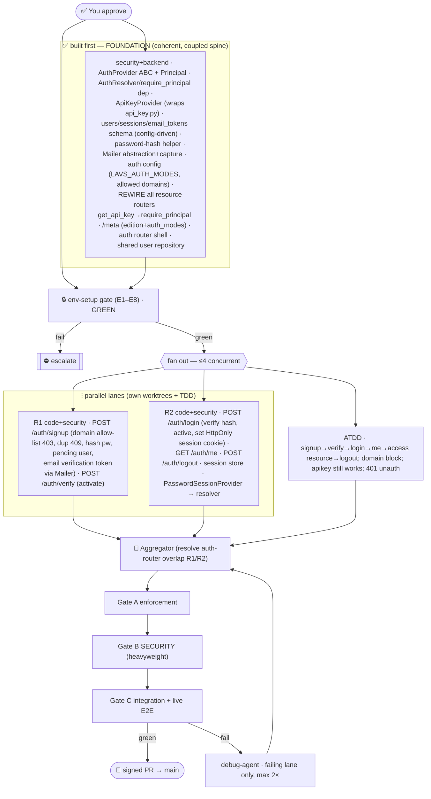

# P4 Auth (OSS) — Multiagent Parallel Execution Plan

> **Status:** ✅ **P4 COMPLETE & GREEN (2026-07-11).** OSS auth shipped — pluggable AuthProvider +
> require_principal (fail-closed when configured, open when not), password+sessions (signup → email/domain
> verification → login → /auth/me → logout), ApiKeyProvider, /meta. **373 tests**, ruff/pyright clean.
> **Gate B security review: 11/11 invariants PASS, zero defects** (argon2id, hashed/expiring/single-use
> tokens, HttpOnly+Secure+SameSite cookies, timing-safe no-enumeration login, 100% parameterized SQL).
> Live-socket smoke: fail-closed 401 / API-key 200 / /meta correct. One usability fix applied (login email
> normalization). Signed commits. Next: P3 (Multi-DB) · P5 (Frontend, needs this).
>
> **Original plan (awaiting-approval, 2026-07-11).** Would branch `feat/18-p4-auth-oss` off `main`
> (P2 merged @ `fa010c4`). Commit signing active. Epic #18 · Linear *P4 — Auth (OSS)*.
> Presented in full per the 9-section governance framework. **Nothing fires until you approve.**
> (P3 Multi-DB is the parallel alternative — both depend only on P2; redirect if you'd rather do P3.)

Delivers real OSS auth per `API_CONTRACT.md` §1–2: a **pluggable `AuthProvider`** selected by deploy
config, **password + sessions** (signup, email + domain verification, login/logout/me), an **API-key
provider** wrapping the existing module, and `/meta` reporting `edition` + `auth_modes`.

---

## 1. Conventions loaded
Same governing set as P0–P2 (re-read): `.claude/conventions/core/general.md` (1-class/file, snake_case,
typed errors, flag new deps), `.claude/conventions/languages/python.md` (uv/ruff/pyright-strict, `T|None`,
no constants→enum/config, no `cast`/`setattr`, `__init__.py`, interface-style ABCs, context managers),
`.prompticorn.yaml` (DuckDB, **raw SQL no ORM**, exceptions, Conventional Commits, coverage L80/B70/F90/S85),
`ARCHITECTURE.md` (layering, immutable data, lifespan-managed connection, parameterized SQL), `API_CONTRACT.md`
§1–2 (auth model/flows/endpoints — the authority), `ROADMAP.md` P4 (exit criteria).
**Gaps flagged:** G1 mutation testing still not wired · G2 `app/`↔`backend/api` drift (unchanged) ·
**G-P4a — new dependency required** (password hashing — see §8) · **G-P4b — email transport** (in-process
capture Mailer for the pipeline; SMTP is a config swap; no external mailpit daemon).

## 2. Agent roster → P4 roles
Orchestration=harness · env-runner=`devops-agent` · **auth abstraction + security=`security-agent`+`backend-agent`**
(foundation) · signup/verify impl=`code-agent`+`security-agent` (R1) · login/session impl=`code-agent`+`security-agent`
(R2) · ATDD=`test-agent` (ATDD mode) · TDD=`test-agent` per lane · enforcement=`enforcement-agent` (Gate A) ·
**security review=`security-agent` (Gate B — heavyweight this phase)** · integration=`review-agent` (Gate C) ·
debug=`debug-agent`. No-clean-agent gaps (A/B/C) handled as in P0–P2. Security-sensitive phase ⇒ Gate B is
first-class, not a rubber stamp.

## 3. Environment manifest (Step 4 — hard prerequisite gate)
`env-setup` (devops persona) stands up + health-checks before any lane; updates `ENVIRONMENT.md`.

| # | Service | Purpose | Health check | Notes |
|---|---|---|---|---|
| E1 | Python 3.14 / uv | toolchain | `uv run python -V`; `import app.main` | + new hashing dep (§8) synced |
| E2 | DuckDB | datastore | `users`+`sessions`+`email_tokens` present after boot | config-driven init |
| E3 | Uvicorn `:8001 --reload` | live API for E2E | `/health`→200 | **down during pytest** (DuckDB single-writer, per P2 protocol) |
| E4 | pyright (strict) | types | 0 errors | one-shot per checkpoint |
| E5 | ruff | lint | clean | — |
| E6 | pytest + cov | tests | 257 baseline green | — |
| E7 | **In-process capture Mailer** | catch verification emails deterministically (no SMTP daemon) | a sent verification token is retrievable from the capture sink | replaces external mailpit for the pipeline |
| E8 | Docker | verify-only | `docker version` | image unchanged |

Any failure ⇒ BLOCKER, escalate. Resource lanes self-verify in their own worktrees.

## 4. Execution map

## 5. Subagent specification
- **env-setup** (devops): E1–E8 + `ENVIRONMENT.md` + readiness GREEN.
- **Foundation** (security+backend; built + gated before lanes branch): Principal model; `AuthProvider` ABC
  (`authenticate(request) -> Principal | None`); provider **registry** + `AuthResolver` (tries each enabled
  provider; passes if any returns a Principal; else 401); `require_principal` FastAPI dependency; **ApiKeyProvider**
  wrapping `app/security/api_key.py`; **schema** `users(id,email,password_hash,status,created_at)` +
  `sessions(id,user_id,token_hash,created_at,expires_at)` + `email_verification_tokens(token_hash,user_id,expires_at)`
  (config-driven init); **password-hash helper** (argon2id); **Mailer** ABC + in-process capture backend;
  **auth config** (`LAVS_AUTH_MODES`, allowed-domain list, session TTL) via pydantic-settings/YAML;
  **rewire** every resource router `Depends(get_api_key)` → `Depends(require_principal)`; **`GET /meta`**
  (`{edition:"oss", auth_modes:[…]}`); `app/routers/auth.py` shell; **shared user repository** (create/get-by-email/activate).
- **R1** (code+security): `POST /auth/signup` {email,password} → 403 `domain_not_allowed` if domain not in allow-list,
  409 if exists, else hash pw + create `pending` user + issue verification token + `Mailer.send`; 202
  `{status:"pending_verification"}`. `POST /auth/verify` {token} → activate (`active`), 200 {user}. Owns
  `app/auth/signup/*`, its routes in `auth.py`, tests.
- **R2** (code+security): `POST /auth/login` {email,password} → verify hash (timing-safe) + user `active` → create
  server-side session + `Set-Cookie: lavs_session` (HttpOnly, Secure, SameSite=Lax); `GET /auth/me` → principal (401 if none);
  `POST /auth/logout` → clear session. **PasswordSessionProvider** (authenticates via session cookie) registered into the
  resolver. Owns `app/auth/session/*`, its routes in `auth.py`, tests.
- **TDD×(R1,R2)** (test-agent): unit+integration beside each lane, ≥ coverage floors.
- **ATDD** (test-agent): full-flow acceptance (below).
- **Aggregator/Gates/Debug**: as P0–P2; **auth-router overlap** (R1 signup/verify + R2 login/me/logout in `auth.py`)
  resolved by unioning routes (pre-declared hazard).

## 6. Convention enforcement
1-class/file·snake_case (Gate A) · no constants→enum/config: `LAVS_AUTH_MODES`, statuses, cookie name (Gate A) ·
`T|None`/no `cast`/`__init__.py` (Gate A + pyright) · **parameterized SQL** (Gate B) · **security invariants**
(Gate B, see §7) · coverage floors (Gate C) · Conventional Commits + `#18` + **signed** (pre-PR).

## 7. Test strategy & security invariants (Gate B — first-class)
- **ATDD (before/parallel):** signup (allowed domain) → 202 pending → verify token → 200 active → login → session cookie →
  `GET /auth/me` 200 → access a resource route 200 → logout → `/auth/me` 401. Negatives: disallowed domain → 403; duplicate
  email → 409; login before verify → fails; bad token → fails; **API-key header still authenticates headless**; unauthenticated
  resource access → 401 **when a provider is enabled**. `/meta` reports edition+auth_modes.
- **TDD (with code):** per lane; mocks per `test-mocking-rules`; AAA.
- **Gate B security invariants (must all hold):** argon2id password hashing (never plaintext/reversible) · session &
  verification tokens are high-entropy (`secrets`), stored **hashed**, single-use/expiring · cookies `HttpOnly+Secure+SameSite=Lax`
  · timing-safe secret comparisons · **no user enumeration** (generic signup/login errors) · parameterized SQL only · no secrets
  logged · `require_principal` **fails closed when a provider is enabled**, open only when none configured (see §8 decision).

## 8. Gap report & decisions to sanity-check
| ID | Item | Decision / fallback |
|---|---|---|
| **G-P4a** | **New dep: password hashing** | **`argon2-cffi`** (argon2id; modern, strong). Flagged per conventions — pure-python-ish wheel, no system libs. (Alt: `bcrypt`.) |
| **G-P4b** | Email transport | **In-process capture Mailer** for the pipeline (deterministic, no daemon); SMTP backend is a config swap. |
| **G-P4c** | **Backward-compat vs "all routes require auth"** | `require_principal` **fails closed when any provider is enabled** (`LAVS_AUTH_MODES` non-empty / API key set) and is **open when nothing is configured** — mirroring today's API-key behavior. Keeps the **257 existing tests green** (no auth configured) while enforcing the contract in real deployments. Auth ATDD explicitly enables providers to assert 401s. |
| **G-P4d** | Session store | Server-side `sessions` table in DuckDB; opaque token in HttpOnly cookie; token stored hashed; TTL-expiring. |
| **G-P4e** | RBAC | Out of scope (v1 = authenticated⇒allowed); Principal shaped to accept org/role later. |
| **G1/G2** | mutation testing / path drift | unchanged, documented. |
| **A/B/C** | ATDD/env-runner/parallel-orchestration agents | test-agent mode / devops / harness. |

## 9. Debug & retry
`debug-agent`; failures surface at Gates A/B/C (Gate B is the gatekeeper for this phase); retry **failing lane only**,
max 2×, with context injected; escalate on >2 retries, cross-cutting `auth.py`/resolver conflicts, an env blocker, or a
security-invariant ambiguity. Pause + re-present on material change.

---

## Approval
**On approval:** create `feat/18-p4-auth-oss` + Linear issues → run **env-setup** (incl. new hashing dep + capture Mailer) →
build + gate **Foundation** → fan out **R1 + R2 + ATDD** (≤4 concurrent) each in its own worktree forking TDD → aggregate →
enforcement → **security (heavyweight)** → integration + live E2E (signup→verify→login→me→resource→logout over real HTTP) →
signed PR to `main` (#18).

**Three decisions to confirm while reviewing** (all have sensible defaults above): (a) **`argon2-cffi`** as the new hashing
dependency; (b) **fail-closed-when-configured, open-when-not** auth default (keeps existing tests green); (c) **in-process
capture Mailer** instead of an external mail daemon. **Reply to approve, or redirect (incl. to P3).**
