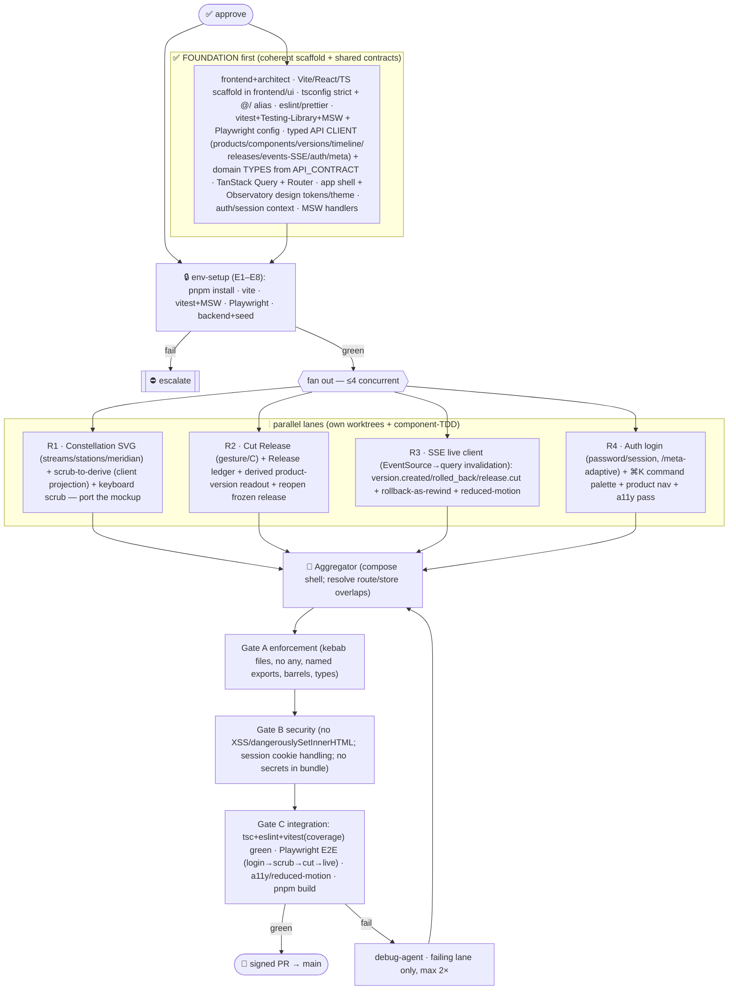

# P5 Frontend — the Constellation UI — Multiagent Parallel Execution Plan

> **Status:** ⏸ **AWAITING APPROVAL (2026-07-12).** Would branch `feat/19-p5-frontend` off `main`
> (P3 merged @ `e849fe7`). Signing active. Epic #19 · Linear *P5 — Frontend*. Presented per the
> 9-section governance framework. **Nothing fires until you approve.** (P6 EE/Stytch is the fast-follow.)
> **Note:** first frontend phase — a new TS/React/pnpm/vitest/Playwright toolchain (Node 20.20.2 / pnpm
> 10.33.4 confirmed present). Largest single phase; a working `constellation.html` mockup exists to port.

Build the **Constellation** UI (`UI_CONCEPT.md`) in `frontend/ui` against the now-complete API — browse
products/components/versions/releases, **scrub a meridian to derive a product version, cut a release by
gesture**, and see streams **update live via SSE**; login adapts to the active auth mode (`/meta`).

---

## 1. Conventions loaded
`.claude/conventions/languages/typescript.md` (**TS strict, no `any`→`unknown`**; `interface` for shapes,
`type` for unions; explicit return types; **kebab-case files**, camelCase vars, PascalCase types; **named
exports**; barrel `index.ts`; path alias `@/`; import order external→internal→types; ESLint+Prettier;
**vitest**; coverage L80/B70/F90/S85; Testing-Library for components, **Playwright** E2E, MSW for API mocks;
`enum` sparingly→const unions). `.prompticorn.yaml` (frontend at **`frontend/ui`**, TS6/pnpm/vitest/eslint/
prettier, coverage floors). `UI_CONCEPT.md` (the design authority — Observatory aesthetic, streams/stations/
meridian, scrub-to-derive, cut, ledger, keyboard-first, a11y/reduced-motion). `API_CONTRACT.md` §3/§5/§6/§7
(endpoints/schemas/SSE/data-lifecycle — the FE builds strictly against this). `ROADMAP.md` P5 (exit criteria).
**Gaps flagged:** G-P5a new toolchain/deps (§8) · G-P5b Playwright browser download in env (§3) · G-P5c
auth mode: backend supports password+apikey; the UI implements **password login (session cookie)** + reads
`/meta` to adapt (Stytch is P6).

## 2. Agent roster → P5 roles
Orchestration=harness · env-runner=`devops-agent` (pnpm/vite/vitest/Playwright + backend for E2E) · scaffold+
api-client+design-system=`frontend-agent`+`architect-agent` (foundation) · Constellation view=`frontend-agent`
(R1) · cut+ledger=`frontend-agent` (R2) · SSE-live=`frontend-agent` (R3) · auth-login+palette+a11y=`frontend-agent`
(R4) · component/E2E tests=`test-agent` per lane + Playwright ATDD · enforcement=`enforcement-agent` (A) ·
security=`security-agent` (B — XSS/session-cookie/CSP) · integration/a11y review=`review-agent` (C) · debug=`debug-agent`.

## 3. Environment manifest (Step 4 — hard prerequisite gate)
`env-setup` (devops) before any lane; updates `ENVIRONMENT.md`. **Node/pnpm present (✅).**

| # | Service | Purpose | Health check | Notes |
|---|---|---|---|---|
| E1 | Node 20 / pnpm | toolchain | `node -v` (✅ 20.20.2), `pnpm -v` (✅ 10.33.4) | — |
| E2 | Vite/React/TS scaffold + `pnpm install` | app builds | `pnpm build` / `pnpm tsc --noEmit` clean | foundation creates it |
| E3 | **Vite dev server** | live UI | `GET http://127.0.0.1:5173` 200 | background; proxy `/api`→backend :8001 |
| E4 | **Uvicorn backend (DuckDB)** + seed | real API for E2E + live SSE | `/health` 200; seeded product/components/versions | for Playwright/dev only |
| E5 | eslint + prettier | lint/format | clean | — |
| E6 | vitest + Testing-Library + MSW | unit/component tests | sample test runs green | MSW mocks the API (no backend for unit) |
| E7 | **Playwright + browsers** | E2E | `pnpm playwright install --with-deps chromium`; a trivial E2E passes | browser download (G-P5b) — if blocked, mark & fall back to component+MSW integration |
| E8 | tsc strict | types | `tsc --noEmit` 0 errors | continuous |

Any hard failure ⇒ escalate. **If Playwright browsers can't download**, E2E degrades to Testing-Library + MSW
integration coverage (logged, not silently skipped) and a manual live smoke.

## 4. Scope
**In (core — meets exit criteria):** scaffold + typed API client + Observatory design system; **Constellation
home** (SVG streams/stations/meridian, **scrub-to-derive**, keyboard scrub); **Cut Release** (gesture/`C`) +
**Release ledger** (re-open a release as its frozen constellation) + live product-version readout; **live SSE**
(new star on `version.created`, dim/strike on `version.rolled_back`, ledger entry on `release.cut`); **auth login**
(password/session, adapts to `/meta`); **a11y** (keyboard-first, reduced-motion, non-color signals); ⌘K palette.
**Stretch (if time, else deferred):** component-focus zoom · product galaxy (all products) · diff-two-meridians.
**Out:** Stytch/EE login (**P6**); backend changes (API is frozen — FE consumes only).

## 5. Execution map

## 6. Subagent specification
- **env-setup** (devops): E1–E8 + `ENVIRONMENT.md` + GREEN; scaffold builds, a sample vitest + a trivial Playwright pass, backend seeded.
- **Foundation** (frontend+architect; built + gated before lanes): Vite+React+TS app in `frontend/ui`; `tsconfig`
  strict + `@/`; eslint/prettier; vitest + Testing-Library + **MSW** handlers mirroring the API; Playwright config;
  **typed API client** (one module per resource, `Result`-style typed errors, `EventSource` SSE client) +
  **domain types** from `API_CONTRACT` §3 (Product/Component/Version/Release/Timeline/Principal/Meta);
  **TanStack Query** + **React Router**; **app shell** + **Observatory design tokens** (dark canvas, per-component
  hue, mono for versions); **auth/session context** (calls `/auth/me`, `/meta`); barrel exports. Keep `tsc`/eslint/
  vitest green with a smoke test.
- **R1 Constellation** (frontend): SVG `streams`/`stations`/`meridian` components from `timeline` data; **scrub-to-
  derive** (meridian pins latest station ≤ position per component — pure client projection); keyboard `←/→`;
  virtualize long timelines. Port the mockup's geometry/logic to typed React. Component tests (Testing-Library).
- **R2 Cut + Ledger** (frontend): the derived product-version **readout**; **Cut Release** (button + `C`) → `POST
  /products/{id}/releases` (label), crystallize animation, optimistic ledger add; **Release ledger** list (`GET
  .../releases`) + **reopen** a release (`GET /releases/{id}`) as its frozen constellation. Tests + MSW.
- **R3 SSE live** (frontend): `EventSource` on `/products/{id}/events`; on `version.created` add a pulsing star,
  `version.rolled_back` dim/strike + re-light prior, `release.cut` add ledger entry — via TanStack Query cache
  updates/invalidation; reconnect/backoff; **reduced-motion** collapses animation to instant. Tests.
- **R4 Auth + chrome** (frontend): login form (email/password → `POST /auth/login`, session cookie) shown per
  `/meta.auth_modes`; `/auth/me` gating + logout; **⌘K command palette** (navigate/cut/scrub); product nav;
  **a11y pass** (roles/labels, focus, non-color signals, keyboard-only). Tests.
- **ATDD/E2E** (test): Playwright — login → open product → scrub meridian (readout changes) → **Cut Release** →
  appears in ledger → a live `version.created`/`release.cut` updates the view; reduced-motion; keyboard-only path.
- **Aggregator/Gates/Debug**: compose the shell/routes (pre-declared overlap: shell nav + query cache keys — foundation
  owns the shell + keys so lanes slot in). **Gate B**: no `dangerouslySetInnerHTML`/XSS; session via HttpOnly cookie
  (JS never reads it); no secrets baked into the bundle; CSP-friendly.

## 7. Test strategy
- **Component/unit (vitest + Testing-Library + MSW):** each lane's components against mocked API — scrub math,
  cut flow, SSE reducers, login, palette, a11y roles. Coverage floors L80/B70/F90/S85.
- **E2E (Playwright, the P5 "ATDD"):** the critical user flow end-to-end against a **real seeded backend** — the
  exit criterion made executable (browse → scrub → cut → live update). Reduced-motion + keyboard-only variants.
- **Validation** at Gate C: `tsc --noEmit` + eslint + vitest(coverage) + Playwright + `pnpm build` + an a11y check
  (axe) on the main view.

## 8. Gap report & decisions to sanity-check
| ID | Item | Decision / fallback |
|---|---|---|
| **G-P5a** | **New toolchain/deps** (frontend) | **React + Vite + TypeScript 6 + pnpm + vitest + @testing-library/react + MSW + Playwright + TanStack Query + React Router**. All FE-local (isolated in `frontend/ui`); backend untouched. Flagged. |
| **G-P5b** | Playwright browser download | env-setup runs `playwright install chromium`; if blocked, E2E degrades to Testing-Library+MSW integration + manual smoke (logged). |
| **G-P5c** | Auth mode in UI | Implement **password/session login** + read `/meta` to show the right mode; API-key is headless (no UI). **Stytch/EE is P6.** |
| **G-P5d** | Time axis (UI_CONCEPT §8) | **Ordinal "release ticks"** (as the mockup) for v1 clarity; real-timestamp axis is a later toggle. |
| **G-P5e** | Product-version derivation shown while scrubbing | Client mirrors the server rule (**minor bump from base**, per P2) for the live readout; the authoritative value still comes from the server on cut. |
| **G-P5f** | State lib | **TanStack Query** for server state + minimal React state (meridian pos, selected product); no Redux. |
| **G-P5g** | Scope: core vs stretch | Core (Constellation+cut+ledger+SSE+auth+a11y) meets the exit criterion; galaxy/component-focus/diff-two-meridians are **stretch/deferred**. |
| G1/G2 | mutation testing / `app/` path | frontend uses `frontend/ui` per config (no drift here); stryker mutation deferred with backend `mutmut`. |

## 9. Debug & retry
`debug-agent`; failures surface at Gates A/B/C (Gate C — the Playwright flow + `pnpm build` — is the gatekeeper).
Retry **failing lane only**, max 2×, context injected; escalate on >2 retries, a shell/routing/query-key conflict
the aggregator can't reconcile, an env blocker (Playwright/browser), or a UX/scope ambiguity. Pause + re-present on
material change.

---

## Approval
**On approval:** create `feat/19-p5-frontend` + Linear issues → **env-setup** (scaffold, pnpm install, vitest+MSW,
Playwright, seeded backend) → build + gate **Foundation** (scaffold + API client + design system + auth context) →
fan out **R1 Constellation + R2 Cut/Ledger + R3 SSE-live + R4 Auth/palette/a11y** (≤4 concurrent, own worktrees,
component-TDD) → aggregate → enforcement → security → integration (**Playwright login→scrub→cut→live** + a11y +
`pnpm build`) → signed PR to `main` (#19).

**Four decisions to confirm** (defaults above): (a) **React + Vite + TanStack Query + Playwright** stack;
(b) **core scope** (galaxy/diff deferred as stretch); (c) **ordinal time axis** for v1; (d) **password/session
login** in the UI (Stytch deferred to P6). **Reply to approve, or redirect.**
