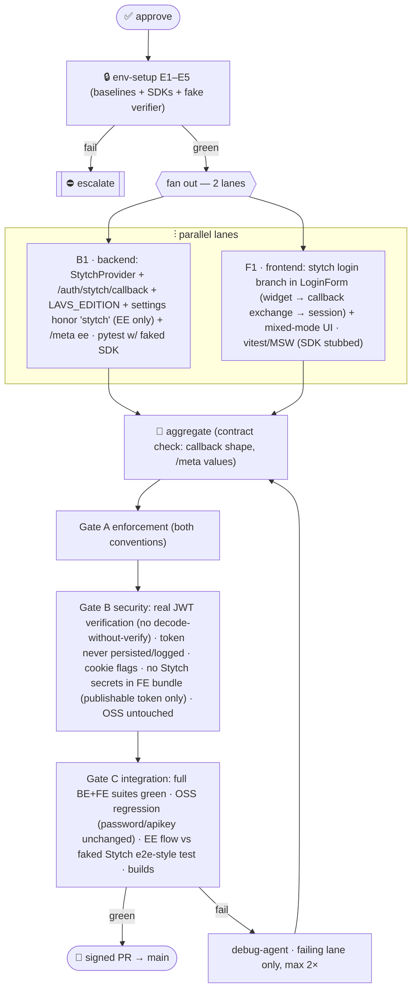

# P6 EE (Stytch) — Multiagent Parallel Execution Plan

> **Status:** ✅ **EXECUTED (2026-07-23).** Approved with all four default decisions (G-P6b/c/e/f).
> Branch `feat/20-p6-ee-stytch` off `main` @ `11ac6da`. Epic #20 · Linear LAV-37..40.
> Lanes B1 ∥ F1 → aggregation → Gate A PASS (5 MINOR, fixed) → Gate B FAIL (3 HIGH:
> unverified-email ATO, provider users-table bypass, allowlist skip) → debug pass (retry 1/2)
> → Gate B re-check PASS → Gate C: BE 466 pytest + ruff/format/pyright · FE 118 vitest +
> typecheck/lint/build · Playwright 4/4. OSS `/meta` byte-identical (`response_model_exclude_none`).

Implement the **EE managed-identity path**: a backend `StytchProvider` that verifies a Stytch
session and issues the normal `lavs_session` cookie (`POST /auth/stytch/callback`, API_CONTRACT §2),
plus the **frontend Stytch login** rendered when `/meta` advertises `stytch`. OSS behavior is
untouched — acceptance is literally "the OSS build and all resource routes are unchanged."

---

## 1. Conventions loaded
`.claude/conventions/languages/python.md` (BE: 3.14/uv/pytest/ruff, exceptions-style errors) ·
`.claude/conventions/languages/typescript.md` (FE: strict, no `any`, kebab/named-exports/barrels,
vitest+MSW, coverage L80/B70/F90/S85) · `API_CONTRACT.md` §1–2 (auth modes, provider abstraction,
`POST /auth/stytch/callback {stytch_token}` → verify → issue `lavs_session`; the rest of the API is
identical regardless of how the `Principal` was obtained) · `ROADMAP.md` P6 (exit criteria).
**Gaps flagged:** G-P6a Stytch SDK deps (BE `stytch`; FE `@stytch/vanilla-js`) · G-P6b no live
Stytch tenant in CI → provider-boundary fakes + manual smoke · G-P6c edition wiring (`LAVS_EDITION`)
· G-P6d `auth_settings` currently *ignores* the `stytch` token — must start honoring it (EE only).

## 2. Agent roster → P6 roles
Orchestration=harness · env-runner=`devops-agent` (deps + green baselines) · **B1** backend
Stytch provider=`backend-agent`+`security-agent` · **F1** frontend Stytch login=`frontend-agent` ·
tests=`test-agent` per lane · enforcement=`enforcement-agent` (A) · security=`security-agent`
(B — token handling/JWT verification/cookie issuance) · integration=`review-agent` (C) · debug=`debug-agent`.

## 3. Environment manifest (hard prerequisite gate)
| # | Item | Health check | Notes |
|---|---|---|---|
| E1 | BE baseline | `uv run pytest -q` green @ `11ac6da`; pyright/ruff clean | pre-change baseline |
| E2 | FE baseline | `pnpm test` (107) + `pnpm e2e` + build green | pre-change baseline |
| E3 | `stytch` python SDK | `uv add stytch` + import OK | G-P6a; runtime dep, flagged |
| E4 | `@stytch/vanilla-js` | `pnpm add` + build OK | G-P6a; FE-local, flagged |
| E5 | Fake Stytch verifier | unit-injectable fake client passes a sample verify | no network in tests (G-P6b) |

Any hard failure ⇒ escalate. No live Stytch tenant is required for any gate (G-P6b); a real-tenant
manual smoke runs post-merge when credentials exist.

## 4. Scope
**In:** `StytchProvider.authenticate` (verify Stytch session JWT/token via SDK, map to `Principal
(kind=user, edition=ee)`) · `POST /auth/stytch/callback {stytch_token}` → verify → create the normal
server-side session + `HttpOnly lavs_session` cookie · honor `stytch` in `LAVS_AUTH_MODES` **iff**
`LAVS_EDITION=ee` (else ignored, as today) · `/meta` reports `edition:"ee"` + `stytch` mode · FE:
replace the `LoginForm` "managed sign-in — coming soon" branch with the **Stytch widget**
(magic-link + OAuth), exchange the returned token at the callback route, then the normal
`/auth/me` session flow; mixed-mode UI (password *and* stytch both enabled) renders both paths ·
tests both sides with fakes/MSW. **Out:** RBAC/orgs · SCIM/provisioning · MFA policy config ·
changing any resource route or OSS default (`LAVS_AUTH_MODES=password,apikey` stays).

## 5. Execution map

## 6. Subagent specification
- **env-setup:** E1–E5; update `ENVIRONMENT.md` (`P6_ENV_READY`).
- **B1 (backend):** `app/auth/providers/stytch_provider.py` implementing `AuthProvider` (inject the
  Stytch client; verify session; map to `Principal`); callback route in the auth router (`202/401`
  per error model); `LAVS_EDITION` setting (default `oss`); `auth_settings` honors `stytch` only in
  EE (G-P6d); `/meta` reflects it; registry wiring. Tests: fake SDK — valid/expired/garbage token,
  OSS-mode rejection, settings matrix, callback → session cookie round-trip.
- **F1 (frontend):** `stytch-login.tsx` under `src/features/auth/` (new files only, same lane rules
  as P5): load widget with the **publishable** token from `/meta` (extend `Meta` type optionally) or
  env; on Stytch success POST `{stytch_token}` to callback via the typed client (new `api/auth.ts`
  fn `stytchCallback`); then normal session flow. `LoginForm` renders it when `stytch` enabled;
  both-modes layout. MSW handler for the callback; widget stubbed in tests.
- **Gates/Aggregator/Debug:** as P5; Gate B is the heavyweight here (see map).

## 7. Test strategy
BE: pytest with an injected fake Stytch client (no network) — provider matrix + callback flow + OSS
regression suite untouched. FE: vitest/MSW — mode-matrix rendering (password / stytch / both /
apikey-only), callback exchange, error surfaces; widget itself stubbed (it's Stytch's code, not
ours). Gate C: both full suites + builds + the P5 Playwright suite still green (OSS path).

## 8. Gap report & decisions to sanity-check
| ID | Item | Decision / fallback |
|---|---|---|
| **G-P6a** | New deps | BE **`stytch`** (runtime) · FE **`@stytch/vanilla-js`** (prebuilt widget). Flagged. |
| **G-P6b** | No Stytch tenant in CI | Verify at the provider boundary with an injected fake; **no live-network test**. Manual smoke doc for when a tenant exists. |
| **G-P6c** | Edition flag | New env **`LAVS_EDITION=oss|ee`** (default `oss`); `stytch` in `LAVS_AUTH_MODES` honored only when `ee`. |
| **G-P6d** | Settings today ignore `stytch` | Start honoring it per G-P6c — a deliberate, tested behavior change (EE only). |
| **G-P6e** | Stytch surface | **Consumer** product, passwordless **magic links + OAuth** via the prebuilt widget (roadmap says "Stytch widget"). B2B/organizations deferred. |
| **G-P6f** | Publishable token delivery | Served via `/meta` (optional field) so one FE build works per-deploy; fallback `VITE_STYTCH_PUBLIC_TOKEN`. |

## 9. Debug & retry
As P5: failures surface at Gates A/B/C; retry failing lane only, max 2×; escalate on Stytch-SDK
surprises (API shape drift), any OSS regression, or a security finding at Gate B. Pause + re-present
on material change.

---

## Approval
**On approval:** create `feat/20-p6-ee-stytch` + Linear issues (epic + env/B1/F1/gates) → env-setup
→ fan out **B1 ∥ F1** → aggregate → Gates A/B/C → signed PR → `main` (#20).

**Four decisions to confirm** (defaults above): (a) **consumer Stytch + prebuilt widget** (magic
link + OAuth), B2B deferred (G-P6e); (b) **no live-Stytch test** — fakes at the provider boundary +
manual smoke doc (G-P6b); (c) **`LAVS_EDITION` env** gates the mode (G-P6c/d); (d) publishable
token via **`/meta`** (G-P6f). **Reply to approve, or redirect.**
