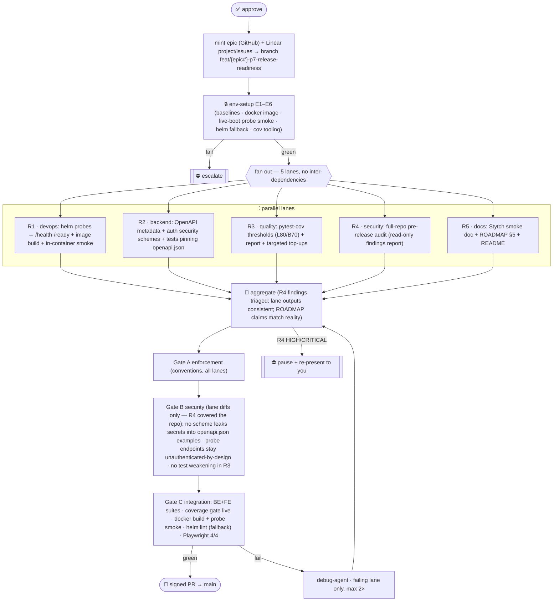

# P7 Release readiness (v1 cut) — Multiagent Parallel Execution Plan

> **Status:** ▶ **EXECUTING (2026-07-23).** Approved with all four defaults (G-P7a/b/c/d).
> Epic **#35** · branch `feat/35-p7-release-readiness` off `main` @ `d83ad3c` · Linear
> *P7 — Release readiness (v1 cut)* **LAV-41..47** (env=41, R1=42, R2=43, R3=44, R5=45,
> gates=46, R4=47). Smallest phase yet (~4d indicative): P7 is ROADMAP §5 *Cross-cutting*
> (the v1 exit checklist) plus P6's promised Stytch smoke doc, packaged as a phase.

Close out everything v1 needs that no feature phase owned: point the Helm probes at the real
`/health`·`/ready` endpoints (which **already exist** — P3/P4 built them; the chart never caught
up), publish OpenAPI docs that carry the auth scheme, measure & enforce backend coverage
targets, run the pre-release security pass, and land the P6 manual-smoke doc.

---

## 1. Conventions loaded
`.claude/conventions/core/general.md` (startup/branch/session governance, SOLID,
one-class-per-file) · `languages/python.md` (3.14/uv/ruff/pyright; typed errors; absolute
imports) · `languages/typescript.md` (strict, no `any`, kebab/named-exports; vitest+MSW,
coverage L80/B70/F90/S85) · `docs/design/API_CONTRACT.md` (§1–2 auth modes — the OpenAPI
schemes must describe exactly these; §8 `/meta`) · `docs/planning/ROADMAP.md` §5–6 ·
`docs/planning/ENVIRONMENT.md` (P3–P6 manifests).
**Gaps flagged:** G-P7a scope legitimacy (P7 is derived from §5, not a phase-table row) ·
G-P7b ROADMAP references coverage targets "per `.prompticorn.yaml`" — **that file does not
exist** (only `.prompticorn/sessions/`); FE thresholds live in `vite.config.ts` (L80/B70/F90/S85),
BE thresholds live nowhere · G-P7c `helm` CLI not installed on this host · G-P7d coverage.py
cannot enforce *function* coverage natively (line/branch only).

## 2. Agent roster → P7 roles
24 agents in `.claude/agents/`. Assigned: orchestration=harness · env-runner=`devops-agent`
(E1–E6) · **R1** Helm/Docker=`devops-agent` · **R2** OpenAPI=`backend-agent` · **R3**
coverage=`test-agent`+`performance-agent` (report) · **R4** pre-release audit=`security-agent`
· **R5** docs=`document-agent` · tests=`test-agent` per lane · enforcement=`enforcement-agent`
(Gate A) · security=`security-agent` (Gate B — re-checks lane diffs; R4 is the *release* pass)
· integration=`review-agent` (Gate C) · debug=`debug-agent`. Unused-this-phase: frontend, data,
mlai, migration, compliance, incident, observability, product, plan, ask, explain, refactor,
architect, code (no gap — no role unfilled).

## 3. Environment manifest (hard prerequisite gate)
| # | Item | Health check | Notes |
|---|---|---|---|
| E1 | BE baseline | `uv run pytest -q` green @ `d83ad3c` (466); ruff/pyright clean | pre-change baseline |
| E2 | FE baseline | `pnpm test` (118) + `pnpm build` green | pre-change baseline |
| E3 | Docker daemon + image | `docker version` OK (29.1.3 verified); `docker build .` succeeds | R1 needs a runnable image |
| E4 | Live app boot | env-agent **starts** uvicorn `:8001`, curls `/health`→200 `{"status":"ok"}` and `/ready`→200, then **stops it cleanly** (documented) | proves probe targets before the chart points at them |
| E5 | Helm render path | `helm` CLI absent (G-P7c) → env-agent verifies the containerized fallback: `docker run --rm -v $PWD/helm/lavs:/chart alpine/helm lint /chart` | fallback flagged; failure ⇒ template-only review |
| E6 | Coverage tooling | `pytest-cov` ≥7 already in dev deps; `uv run pytest --cov=app --collect-only -q` exits 0; FE `vite.config.ts` thresholds present | no new BE deps expected |

Any hard failure ⇒ escalate before fan-out. Nothing here is assumed running — E4 explicitly
starts, verifies, and stops the server; the pipeline owns all infrastructure.

## 4. Scope
**In:** Helm `values.yaml` probes → `/health` (liveness) + `/ready` (readiness) with sane
timings; container build + in-container probe smoke · OpenAPI: app metadata (title/description/
version from `pyproject.toml`), security schemes (`apiKeyAuth` = header `X-API-Key`;
`cookieAuth` = cookie `lavs_session`) surfaced in `/openapi.json`+`/docs`, tests pinning the
document · BE coverage: enforce **line 80 / branch 70** via pytest-cov config in `pyproject.toml`
(function 90 measured & reported only — G-P7d); small targeted test top-ups if under; ROADMAP
§5 corrected re G-P7b · full-repo pre-release security audit (read-only, findings gated) ·
docs: `docs/ops/STYTCH_MANUAL_SMOKE.md` (P6 G-P6b debt), ROADMAP §5 checkboxes, README v1
touch-up. **Out:** new features · MySQL/SQL-Server backends · DuckDB concurrency validation
(ROADMAP §6 — separate decision) · one-shot data migration (§6) · CI pipeline authoring ·
coverage *padding* (a large shortfall escalates rather than gets gamed).

## 5. Execution map

Dependency declaration: R1–R5 depend **only** on env-setup; none on each other (R4 audits
`main`@`d83ad3c` + lane diffs at aggregation). Gates are sequential A→B→C. Debug re-enters at
aggregation, failing lane only.

## 6. Subagent specification
- **env-setup** (devops): E1–E6; append P7 manifest to `ENVIRONMENT.md` (`P7_ENV_READY`); start/stop procedure documented for every process it launches.
- **R1** (devops): `helm/lavs/values.yaml` probes (`/health` liveness, `/ready` readiness, initialDelay/period consistent with app boot), containerized `helm lint`+`template` render check, `docker build` + run + curl both probes in-container, teardown. Outputs: chart diff + smoke transcript.
- **R2** (backend): FastAPI app metadata from `pyproject.toml` version; OpenAPI `securitySchemes` matching API_CONTRACT §1–2 exactly (apikey header + session cookie; stytch callback noted as EE); per-route security only where it reflects reality (resource routes accept either scheme). Tests: `/openapi.json` contains both schemes, correct names, no secrets in examples; `/docs` 200. One-class-per-file, typed.
- **R3** (test/quality): `[tool.pytest.ini_options]`/`[tool.coverage.*]` in `pyproject.toml` — `--cov=app --cov-branch --cov-fail-under=80` + branch report ≥70 asserted in the run script; produce the numbers table; if a module is materially short, add *meaningful* unit tests (AAA, mirrored placement) — >5pt shortfall escalates instead. Function-coverage reported (G-P7d), not enforced.
- **R4** (security): read-only full-repo audit per the `/security-review` discipline (auth spine, SQL paths, SSE, Docker/Helm, deps, secrets hygiene); severity-ranked findings with file:line evidence. HIGH/CRITICAL ⇒ pipeline pauses and re-presents (fix is *your* call — could be in-phase or a hotfix lane). MED/LOW ⇒ filed as Linear issues in the P7 project.
- **R5** (document): `docs/ops/STYTCH_MANUAL_SMOKE.md` (env vars, widget→callback→`/auth/me` walk, expected artifacts, teardown); ROADMAP §5 checkboxes updated + G-P7b correction (point at real threshold homes); README release blurb. No code.
- **Gates/debug:** as P5/P6 — enforcement (A), security-on-diffs (B), integration (C), debug retries failing lane max 2×.

## 7. Test strategy
ATDD first: each lane's acceptance is executable and stated up front — R1 "container answers
`/health`·`/ready` through the chart's probe paths"; R2 "`/openapi.json` carries both schemes"
(pinned by pytest); R3 "`uv run pytest` fails under L80/B70"; R5 reviewed prose. TDD in-lane:
R2/R3 write tests alongside changes per repo AAA patterns. Gate C runs both full suites, the
coverage gate itself, docker+helm smoke, and the P5 Playwright suite (4) as the UI regression
canary.

## 8. Gap report & decisions to sanity-check
| ID | Item | Decision / fallback |
|---|---|---|
| **G-P7a** | P7 isn't in the roadmap phase table | Treat ROADMAP §5 cross-cutting as the phase. **Confirm or redirect scope.** |
| **G-P7b** | `.prompticorn.yaml` (roadmap's coverage source) doesn't exist | Enforce BE thresholds in `pyproject.toml`, FE stays in `vite.config.ts`; fix the ROADMAP reference. |
| **G-P7c** | `helm` CLI absent | Containerized `alpine/helm` lint/template (docker verified up). If the image can't pull ⇒ template-review only, flagged in the PR. |
| **G-P7d** | Function-coverage (F90) not enforceable by coverage.py | Enforce L80/B70; F90 measured & reported. |
| **G-P7e** | No ticket exists yet | Epic + Linear project/issues minted **on approval**; branch named from the real epic number. |

## 9. Debug & retry
As P5/P6: failures surface at Gates A/B/C or aggregation; debug-agent retries the failing lane
only, max 2×; escalate to you on: any R4 HIGH/CRITICAL, a >5pt coverage shortfall, docker/helm
infrastructure failure, or material scope drift — pipeline pauses and re-presents on any of
these.

---

## Approval
**On approval:** mint epic + Linear project (*P7 — Release readiness*) + issues (env/R1–R5/gates)
→ create branch → env-setup E1–E6 → fan out **R1 ∥ R2 ∥ R3 ∥ R4 ∥ R5** → aggregate (R4 triage)
→ Gates A/B/C → signed PR → `main`.

**Four decisions to confirm** (defaults above): (a) **scope** = ROADMAP §5 release-readiness as
P7 (G-P7a); (b) coverage thresholds live in **`pyproject.toml`** (BE) / `vite.config.ts` (FE),
enforce **L80/B70**, report F90 (G-P7b/d); (c) **containerized helm** fallback (G-P7c);
(d) R4 posture: **HIGH/CRITICAL pauses the pipeline**, MED/LOW auto-filed to Linear.
**Reply to approve, or redirect.**
