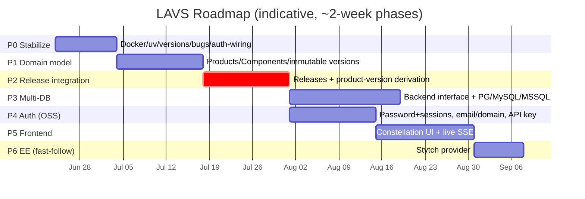

# LAVS Roadmap

Gap-closure roadmap for **LAVS** (lowercase acronym versioning system) — a centralized
REST service that integrates independently-versioned software components into a coherent
*product* version across disparate build pipelines.

See also: [ARCHITECTURE.md](../design/ARCHITECTURE.md) · [UI_CONCEPT.md](../design/UI_CONCEPT.md) · [API_CONTRACT.md](../design/API_CONTRACT.md)

---

## 1. Vision & current state

The problem LAVS solves: when a product is assembled from decoupled components (libraries,
services, UIs, CLIs) each evolving on its own pipeline, there is no sane single owner of
"the product version." Forcing every component to share one version is wrong; having no
integrated version is also wrong. LAVS is the external authority that records per-component
versions and **derives a coherent product version** by pinning a specific component version
into a named release.

Today we are at ~30% of that vision: a clean FastAPI skeleton doing CRUD over a single flat
`Versions` table in DuckDB, with an API-key module that isn't wired in and a container build
that doesn't work. The integrating idea — products composed of components, and releases that
pin component versions — does not exist yet. This roadmap closes that gap in five phases.

## 2. Guiding principles

- **DuckDB-local / Postgres-prod parity** — identical API and behavior on both; DuckDB is the
  default for local dev, PostgreSQL is the production backend.
- **Immutable version history** — versions are append-only; rollback changes status, never deletes.
- **Parameterized SQL only** — no string-interpolated queries, ever.
- **API-first** — every capability is a documented endpoint before it is a UI feature.
- **Innovative UI** — the frontend is a first-class, non-vanilla experience (see UI concept).

## 3. Phases

| Phase | Goal | Key outcomes | Exit criteria |
|-------|------|--------------|---------------|
| **P0 Stabilize** | Make it correct & deployable | Fixed Docker image, version drift, security/correctness bugs, wired auth | Container builds & runs; auth enforced; zero string-SQL; CI green |
| **P1 Domain model** | Products → Components → immutable Versions | New schema + config-driven init; endpoints refactored onto it | Register product→components→versions; history retained |
| **P2 Release integration ⭐** | Derive a coherent product version | `releases` + `release_components`; snapshot & manifest endpoints | Produce & retrieve a product release manifest from mixed component versions |
| **P3 Multi-DB** | Production persistence | Backend interface + dialect DDL; Postgres/MySQL/SQL Server | Same API suite passes on DuckDB **and** PostgreSQL |
| **P4 Auth (OSS)** | Real auth for the OSS v1 | Pluggable providers: password+sessions (signup, email + domain validation) + API key | A user can sign up (verified), log in, and use the UI; headless clients use API keys |
| **P5 Frontend** | The Constellation UI | TS/React app over the API w/ live SSE updates | Browse products/components/versions/releases; cut a release; streams update live |
| **P6 EE (Stytch)** *fast-follow* | Enterprise edition | Stytch provider behind the existing auth abstraction | EE build authenticates via Stytch; OSS untouched |

**Realtime (cross-cutting, lands with P2/P5):** an SSE channel (`GET /products/{id}/events`)
pushes `version.created` / `version.rolled_back` / `release.cut` so the UI updates live. See
[API_CONTRACT.md §6](../design/API_CONTRACT.md).

## 4. Phase detail

### P0 — Stabilize *(blocking)*

- [ ] **Fix the Dockerfile** — currently uses Poetry and copies a nonexistent `poetry.lock`. Switch to **uv**, base image `python:3.14` (not 3.13), and align the port (main.py runs **8001** but the Docker `CMD`/Helm expect **8080**).
- [ ] **Fix version drift** — set ruff `target-version` and pyright `pythonVersion` to **3.14** (`requires-python` is `>=3.14`).
- [ ] **Fix SQL injection** — [create_patch.py](../../app/queries/patch_version/create_patch.py) builds an `INSERT` with f-string interpolation of `product_name`. Parameterize it.
- [ ] **Anchor the semver regex** — [application_and_version_model.py](../../app/models/requests/application_and_version_model.py) uses an unanchored `[0-9]+\.[0-9]+\.[0-9]+`, so `1.2.3.4` and `1.2.3abc` pass. Use `^...$`.
- [ ] **Non-destructive rollback** — [rollback_to_previous_patch_version.py](../../app/queries/patch_version/rollback_to_previous_patch_version.py) `DELETE`s the current row. Replace with a status flag (`rolled_back`) that preserves history.
- [ ] **Wire auth (seed)** — apply the API-key dependency from [api_key.py](../../app/security/api_key.py) to all routers (built + tested, currently unused). This is the minimal gate; the full pluggable auth layer arrives in P4.
- [ ] **Connection lifecycle** — manage the DB connection via FastAPI `lifespan` + a dependency, not per-query.
- [ ] **Cleanup** — delete the stray root file `6.0.0` (accidental pip-output redirect) and remove dead commented code in [main.py](../../app/main.py).

**Acceptance:** container builds & runs; auth enforced when `LAVS_API_KEY` is set; no string-interpolated SQL anywhere; CI (`.github/workflows/python-test.yml`) green.

### P1 — Domain model

- [ ] Introduce `products`, `components`, and immutable `versions` (status: `active|superseded|rolled_back`).
- [ ] Build **config-driven schema initialization** (the `#TODO` in [database.yaml](../../app/configurations/database.yaml) anticipates this).
- [ ] Refactor `/versions` and `/patch` onto the new model.
- [ ] **Move mutations from query-params to request bodies.**
- [ ] Rollback marks status; never deletes.

**Acceptance:** can register product → components → versions; full history retained and queryable.

### P2 — Release integration ⭐ *(the core value)*

- [ ] Add `releases` + `release_components` (pin one version per component).
- [ ] Endpoint to **snapshot** the current active component versions into a named product release.
- [ ] Endpoint to **derive/retrieve** a product version and its release manifest.

**Acceptance:** given N components at mixed versions, produce and retrieve a single coherent product release manifest.

### P3 — Multi-DB backends

- [ ] Define a backend interface (`connect` / `execute` / `init_schema`) with dialect-aware DDL generation — `register_backend()` in [connection_factory.py](../../app/connections/connection_factory.py) already scaffolds this.
- [ ] Implement **PostgreSQL** first, then **MySQL**, then **SQL Server**.
- [ ] Testcontainers-based integration tests per backend.

**Acceptance:** the identical API test suite passes on **DuckDB and PostgreSQL**.

### P4 — Auth (OSS) *(the v1 auth cut)*

OSS auth per [API_CONTRACT.md §1–2](../design/API_CONTRACT.md). Auth is **pluggable** and
selected by deploy config (`LAVS_AUTH_MODES`). EE/Stytch is **out of scope here** — see P6.

- [ ] **Provider abstraction** — `AuthProvider.authenticate(request) -> Principal | 401`; a FastAPI dependency resolves the principal (supersedes the bare P0 key-wiring). Built to accept a Stytch provider later without touching resource routes.
- [ ] **OSS password + sessions** — signup, password hashing, `HttpOnly` session cookies, login/logout/`/auth/me`.
- [ ] **Email + domain validation** — verification-token email flow; signup restricted to an allowed-domain list.
- [ ] **API-key provider** — wrap the existing module for headless/deploy clients.
- [ ] `/health`/`/meta` reports `edition` + enabled `auth_modes` so the UI picks the right login.

**Acceptance:** a user can sign up (with email + domain verification), log in, and operate the UI; headless clients authenticate via API key.

### P5 — Frontend UI

- [ ] Build the **Constellation** UI (see [UI_CONCEPT.md](../design/UI_CONCEPT.md)) in `frontend/ui` (TypeScript 6 / pnpm / vitest) against [API_CONTRACT.md](../design/API_CONTRACT.md).
- [ ] Initial load via `GET /products/{id}/timeline` + `/releases`; **live updates via SSE**.
- [ ] Login UX adapts to the active edition/auth mode.

**Acceptance:** browse products/components/versions/releases, cut a release from the UI, and see streams update live as versions/releases happen.

### P6 — EE (Stytch) *(fast-follow, after OSS v1)*

- [ ] Implement `StytchProvider` behind the existing `AuthProvider` abstraction; verify Stytch sessions, issue a LAVS session.
- [ ] UI renders the Stytch widget when `edition=ee` / `stytch` is in `LAVS_AUTH_MODES`.

**Acceptance:** an EE build authenticates via Stytch; the OSS build and all resource routes are unchanged.

## 5. Cross-cutting

- `/health` and `/ready` endpoints — the Helm probes in `helm/lavs` need real targets.
- OpenAPI docs including the auth scheme.
- Coverage targets (line 80 / branch 70 / function 90, per `.prompticorn.yaml`).
- A security review pass (`/security-review`) before any release.

## 6. Open decisions / risks

- **DuckDB concurrency** — single-writer; not suitable for multi-replica prod (hence Postgres). Validate the local connection model under concurrent requests.
- **Migration** — moving off the flat `Versions` table is a breaking change (accepted); decide whether to provide a one-shot data migration or start fresh.
- **Tracking** — the branch `feat/lavs-design-ui-foundation` lacks a ticket ID; rename to `feat/{TICKET}-...` once a real ticket exists, per the naming convention.
